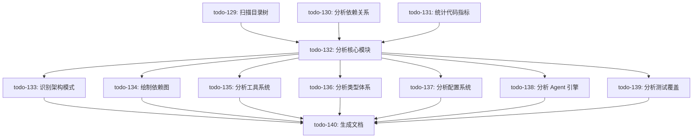

# Xuanji 项目结构分析计划

**创建时间**: 2026-03-16  
**分析版本**: v0.9.0  
**任务总数**: 12 个

---

## 📋 任务依赖关系图



---

## 🎯 执行阶段

### Phase 1: 基础数据收集 (3 个任务)

#### ⬜ todo-129: 扫描项目目录树结构
**目标**: 生成完整的目录树，识别主要模块  
**工具**: `tree`, `find`, `ls`  
**输出**: 
- 目录层级图
- 文件数量统计
- 主要目录识别

**执行命令**:
```bash
# 生成目录树（深度 3 层）
find src -type d -maxdepth 3 | sort

# 统计各目录下的文件数
find src -type f -name "*.ts" | cut -d/ -f1-3 | sort | uniq -c
```

---

#### ⬜ todo-130: 分析 package.json 依赖关系
**目标**: 提取依赖信息，识别关键技术栈  
**工具**: `jq`, `grep`  
**输出**:
- 生产依赖清单 (dependencies)
- 开发依赖清单 (devDependencies)
- 核心技术栈识别

**分析维度**:
- UI 框架: Ink, React
- LLM SDK: @anthropic-ai/sdk, openai
- 工具库: tree-sitter, better-sqlite3
- 构建工具: tsup, vite, typescript

---

#### ⬜ todo-131: 统计代码规模指标
**目标**: 计算代码行数、注释率、文件分布  
**工具**: `cloc`, `wc`, `grep`  
**输出**:
- 总代码行数
- TypeScript 文件数量
- 注释行数/注释率
- 平均文件大小

**执行命令**:
```bash
# 统计 TS 文件行数
find src -name "*.ts" -o -name "*.tsx" | xargs wc -l

# 统计注释行
grep -r "^[[:space:]]*//" src | wc -l
```

---

### Phase 2: 核心模块分析 (1 个任务)

#### ⬜ todo-132: 分析核心模块职责
**目标**: 逐个分析 src 下的目录，定义职责边界  
**依赖**: todo-129, todo-130, todo-131  
**输出**: 模块职责清单

**分析的模块**:
1. `src/core/` — 核心业务逻辑
   - `agent/` — Agent 执行引擎
   - `tools/` — 工具系统
   - `config/` — 配置管理
   - `providers/` — LLM Provider
   - `skills/` — 技能系统
   
2. `src/adapters/` — 适配器层
   - `cli/` — 终端界面
   - `im/` — IM 集成 (飞书/钉钉/企微)
   
3. `src/memory/` — 记忆系统
4. `src/context/` — 项目上下文
5. `src/permission/` — 权限控制
6. `src/mcp/` — MCP 协议
7. `src/session/` — 会话管理
8. `src/hooks/` — 钩子系统
9. `src/learning/` — 学习系统
10. `src/reminder/` — 提醒系统
11. `src/butler/` — 管家服务
12. `src/auth/` — 认证系统

---

### Phase 3: 深度分析 (7 个任务)

#### ⬜ todo-133: 识别架构模式和设计原则
**目标**: 分析分层架构、依赖注入、接口抽象  
**依赖**: todo-132  
**输出**:
- 分层架构图
- 依赖注入模式示例
- 接口/实现分离示例

**关注点**:
- 是否使用依赖注入？
- 接口定义是否独立？
- 模块之间的依赖方向？

---

#### ⬜ todo-134: 绘制模块依赖图
**目标**: 分析 import 关系，识别核心/外围模块  
**依赖**: todo-132  
**输出**: 模块依赖 Mermaid 图

**执行方法**:
```bash
# 提取 import 语句
grep -rh "^import.*from '@" src | sort | uniq

# 统计最常被导入的模块
grep -rh "from '@/.*'" src | sed "s/.*from '@\/\([^']*\)'.*/\1/" | sort | uniq -c | sort -rn
```

---

#### ⬜ todo-135: 分析工具系统实现
**目标**: 研究 32 个工具类的设计模式  
**依赖**: todo-132  
**输出**:
- 工具类继承关系
- 注册机制分析
- 权限检查流程

**分析内容**:
- BaseTool 基类设计
- ToolRegistry 注册机制
- 工具分类 (文件操作/代码搜索/系统集成等)

---

#### ⬜ todo-136: 分析类型定义体系
**目标**: 研究 11 个 types.ts，梳理类型层次  
**依赖**: todo-132  
**输出**: 类型定义树状图

**分析文件**:
- `src/core/types/` (核心类型)
- `src/memory/types.ts` (记忆类型)
- `src/permission/types.ts` (权限类型)
- `src/session/types.ts` (会话类型)
- ...

---

#### ⬜ todo-137: 分析配置管理系统
**目标**: 研究 core/config，识别配置加载机制  
**依赖**: todo-132  
**输出**:
- 配置加载流程图
- 配置优先级规则
- 验证机制分析

**关注点**:
- 全局配置 vs 项目配置
- 环境变量支持
- 配置验证逻辑

---

#### ⬜ todo-138: 分析 Agent 执行引擎
**目标**: 深入研究 AgentLoop 核心逻辑  
**依赖**: todo-132  
**输出**:
- ReAct 循环流程图
- 工具调度机制
- 错误恢复策略

**核心类**:
- `AgentLoop` — 主循环
- `AgentExecutor` — 执行器
- `SubAgentLoop` — 子 Agent
- `ToolDispatcher` — 工具分发
- `StreamProcessor` — 流处理

---

#### ⬜ todo-139: 分析测试覆盖情况
**目标**: 扫描 test 目录，统计覆盖率  
**依赖**: todo-132  
**输出**:
- 测试文件统计
- 覆盖的模块清单
- 未覆盖的模块清单

**执行命令**:
```bash
# 统计测试文件
find test -name "*.test.ts" | wc -l

# 按模块分组
find test -name "*.test.ts" | cut -d/ -f1-3 | sort | uniq -c
```

---

### Phase 4: 文档生成 (1 个任务)

#### ⬜ todo-140: 生成项目结构可视化文档
**目标**: 汇总所有分析结果  
**依赖**: todo-133 ~ todo-139 (全部深度分析任务)  
**输出**: `PROJECT_STRUCTURE_ANALYSIS.md`

**文档结构**:
```markdown
# Xuanji 项目结构分析报告

## 1. 项目概览
- 基本信息
- 技术栈
- 代码规模

## 2. 目录结构
- 目录树
- 模块职责

## 3. 架构设计
- 分层架构
- 设计模式
- 依赖关系

## 4. 核心系统
- Agent 引擎
- 工具系统
- 记忆系统
- 权限控制

## 5. 类型系统
- 类型定义树
- 接口抽象

## 6. 测试覆盖
- 测试统计
- 覆盖分析

## 7. 改进建议
```

---

## 📊 进度追踪

| 阶段 | 任务数 | 已完成 | 进行中 | 待开始 |
|------|--------|--------|--------|--------|
| Phase 1: 基础数据收集 | 3 | 0 | 0 | 3 |
| Phase 2: 核心模块分析 | 1 | 0 | 0 | 1 |
| Phase 3: 深度分析 | 7 | 0 | 0 | 7 |
| Phase 4: 文档生成 | 1 | 0 | 0 | 1 |
| **总计** | **12** | **0** | **0** | **12** |

---

## 🔧 所需工具

### 命令行工具
- ✅ `find` — 文件搜索
- ✅ `grep` — 内容搜索
- ✅ `wc` — 行数统计
- ✅ `tree` — 目录树生成
- ⚠️ `jq` — JSON 处理 (可选)
- ⚠️ `cloc` — 代码统计 (可选)

### Xuanji 内置工具
- ✅ `read_file` — 读取文件
- ✅ `glob` — 文件查找
- ✅ `grep` — 代码搜索
- ✅ `bash` — Shell 命令
- ✅ `write_file` — 生成报告

---

## ✨ 预期成果

### 主报告
**文件**: `PROJECT_STRUCTURE_ANALYSIS.md`  
**预计长度**: 500+ 行  
**包含内容**:
- 完整的目录树
- 12 个模块的详细分析
- 架构设计图谱
- 依赖关系图
- 测试覆盖报告
- 改进建议清单

### 附件
- 模块依赖图 (Mermaid)
- 类型定义树 (Mermaid)
- Agent 执行流程图 (Mermaid)

---

## 🎯 成功标准

- ✅ 所有 12 个任务完成
- ✅ 生成完整的分析报告
- ✅ 识别出所有核心模块职责
- ✅ 绘制清晰的依赖关系图
- ✅ 提供可执行的改进建议

---

**执行者**: Xuanji AI Assistant  
**预计耗时**: 约 20-30 分钟  
**优先级**: 中等

---

## 📝 备注

- 本计划使用 Todo 系统管理进度
- 支持依赖关系自动阻塞
- 可随时查看任务状态: `todo_list`
- 可单独执行任务或批量执行

---

**下一步**: 执行 `todo-129: 扫描项目目录树结构`
