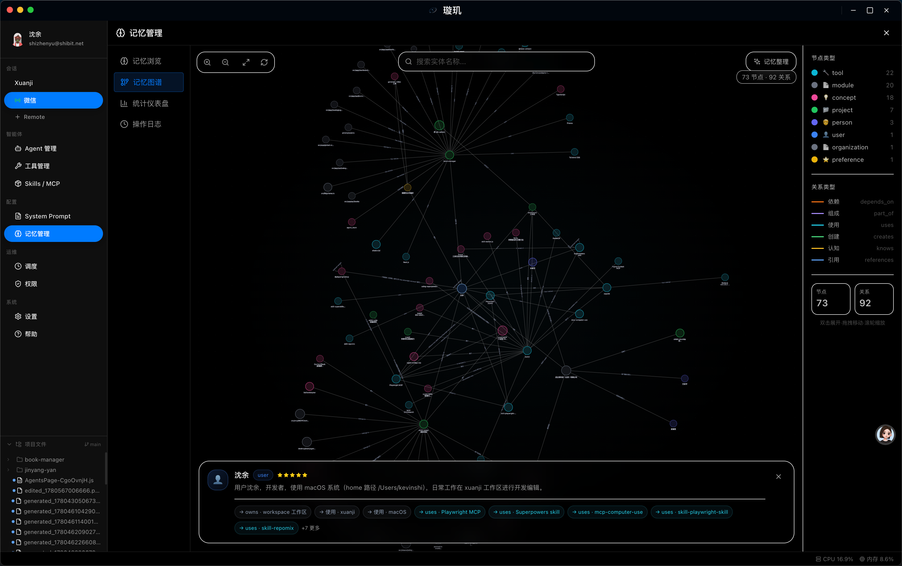
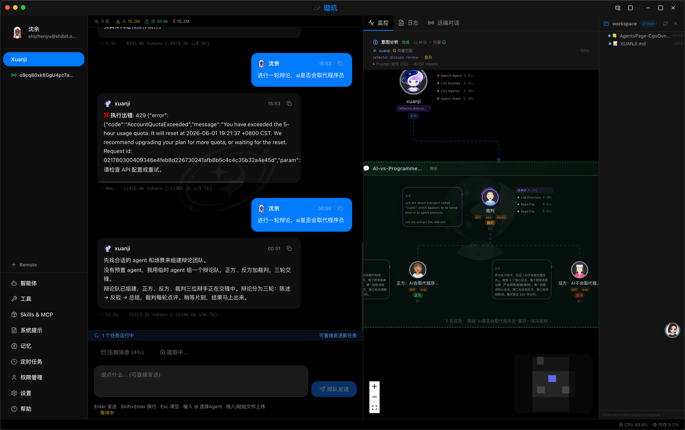
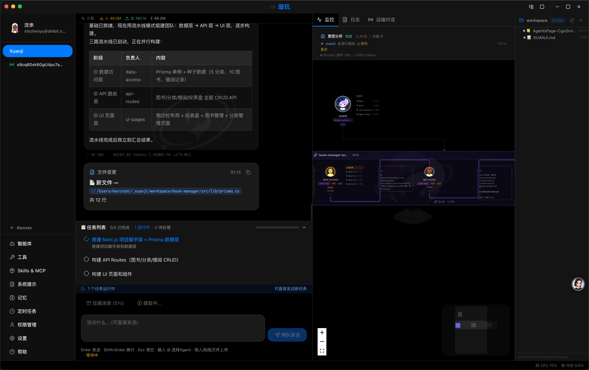
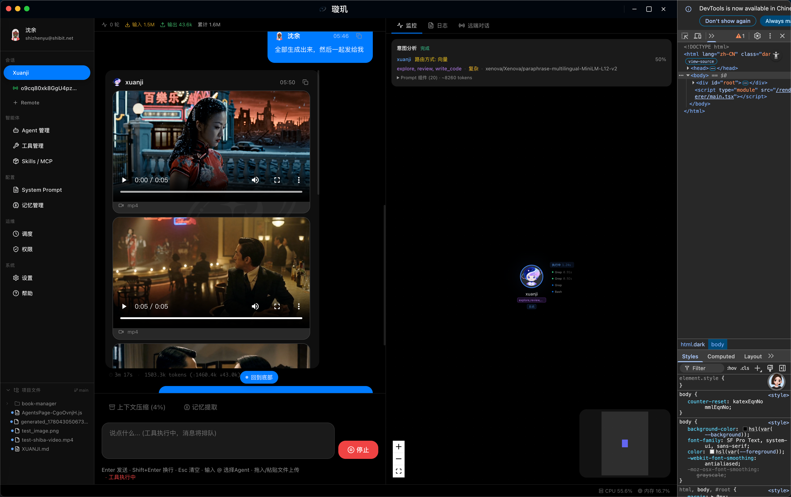

<h1 align="center">Xuanji — Your AI Butler</h1>

<p align="center">
  <a href="https://shibit.net">🌐 Website: shibit.net</a>
  &nbsp;|&nbsp;
  <a href="https://shibit.net/docs/xuanji">📖 Documentation</a>
</p>

<p align="center">
  <strong>Not a chatbot. An AI butler that lives on your computer and gets better the more you use it.</strong>
</p>

<p align="center">
  <a href="https://github.com/shibit-net/xuanji"></a>
  <a href="https://github.com/shibit-net/xuanji"></a>
</p>

<p align="center">
  <a href="./README.md">中文版本</a> | <strong>English Version</strong>
</p>

---

## What is Xuanji?

Anyone who watched Iron Man remembers J.A.R.V.I.S. Tony Stark wakes up, and J.A.R.V.I.S. is already briefing him on the weather, his schedule, and suit diagnostics. Tony says "Optimize the Mark 42 thrust system," and J.A.R.V.I.S. gets to work — not just writing code, but pulling historical test data, comparing alloy heat-resistance curves, running CFD simulations, and producing a report. Tony says "Scrap that, try a different approach," and J.A.R.V.I.S. switches direction instantly — and **never brings up the rejected approach again**.

Tony never has to explain "I meant last week's alloy." Never has to move files between tools. Never has to reintroduce himself at the start of every conversation.

**J.A.R.V.I.S. has three things that no AI assistant today can fully deliver:**

- **It knows you.** Not just "remembers what you said." It truly knows you: your preferences, your habits, the people in your life and how they relate to each other.
- **It doesn't just answer — it does.** A task can span any number of tools and steps. J.A.R.V.I.S. handles the entire chain from start to finish. You never play middleman.
- **It learns.** You correct it once, it never makes that mistake again. It gets better with use.

This is what Xuanji is building toward.

But if you put today's AI assistants in J.A.R.V.I.S.'s place, what happens?

### Scenario 1: The AI That Can't Connect the Dots

Tony says: "Book a restaurant. Morgan doesn't like spicy food, she loves cheeseburgers."

If powered by OpenClaw — it saves the sentence to MEMORY.md. Next time Tony says "book a restaurant," it searches and finds it. But then Tony adds: "Oh, and Pepper mentioned the lasagna at that Italian place was great. Add that too." Now it's lost. Three pieces of information, **no lines connecting them**. It doesn't know Morgan is Tony's daughter, Pepper is his wife, or which restaurant Pepper visited.

If powered by Hermes Agent — same story. Its memory manager can hand data off to mem0 or supermemory, but those providers just **store information**. They don't know "Morgan doesn't eat spicy" is a dietary constraint belonging to the entity "Morgan."

**If powered by Xuanji —** It creates three entities and seven relationships: "Morgan —prefers→ cheeseburgers," "Pepper —prefers→ lasagna," "Pepper —visited→ that Italian restaurant," "Morgan —is→ Tony's daughter," "Pepper —is→ Tony's wife"... Next time Tony says "book a restaurant for my family," Xuanji walks the graph: family members → each person's preferences and constraints → comprehensive recommendation.

> **The difference**: Others store documents — they find sentences you wrote. Xuanji builds a knowledge graph — it knows how everything connects.

### Scenario 2: The AI That Works Alone

Tony says: "Optimize the Mark 42 thrust system. Pull the historical test data, compare three alloy options, run a simulation, and give me a report."

If powered by OpenClaw — it spawns a sub-agent, which works through the task in **one linear chain**. One person pulling data while nobody is simultaneously analyzing materials or prepping the simulation.

If powered by Hermes Agent — it can launch several parallel sub-agents. But when tasks have dependencies (must pick the best alloy before simulating), parallelism breaks down into "everyone scatters, then I'll stitch it together." And there's no debate mechanism — if two agents disagree on the best alloy, Tony has to decide.

**If powered by Xuanji —** Choose `pipeline` strategy: Data Agent → Materials Agent → Simulation Agent → Report Agent. Four agents chained, each output automatically becoming the next input. Two alloys too close to call? Switch to `debate`: two materials experts argue their cases, Tony just reads the conclusion. No suitable agent exists? **Create one on the spot.**

> **The difference**: OpenClaw works alone. Hermes has people working separately. Xuanji is a coordinated team that can expand on demand.

### Scenario 3: The AI That Never Learns

Tony says: "Last time we used the gold-titanium alloy, right? Didn't work. Switch to chromium alloy."

If powered by OpenClaw — it has REM dreaming, which auto-analyzes conversation patterns to **guess** what's important. Gets it right sometimes, wrong other times. And while it changes its answer this time, **the correction never writes back to memory**.

If powered by Hermes Agent — no user-driven memory correction path exists. It answers correctly this time, but in the same scenario tomorrow, it might revert.

**If powered by Xuanji —** "Gold-titanium didn't work" → feedback loop triggers → "Mark 42 —thrust material— gold-titanium" marked as "rejected" → reason attached. Next time Tony says "Mark 43 should use a similar thrust system," Xuanji walks the graph: Mark 42's material → gold-titanium → rejected → auto-skips it, recommends chromium instead. Tony never has to repeat himself.

> **The difference**: OpenClaw guesses (and is often wrong). Hermes forgets (and repeats mistakes). Xuanji is corrected once, updated permanently.

### One More Thing: The Prompt Problem

Even with perfect memory and a great team, LLM attention is finite. OpenClaw and Hermes dump all tool definitions, Skills lists, and context files into the system prompt at once — like making Tony fix a suit while surrounded by a hundred irrelevant engineering manuals. He knows the answers are in there somewhere, but flipping through pages takes longer than doing the work.

Xuanji splits the prompt into three layers: L0 (identity and safety, always present), L1 (10+ scenario rules, only the 1-3 currently needed), L2 (coordination rules, only when coordinating multiple agents). Tony fixes suits with only engineering rules loaded. Runs medical analysis with only medical rules. **What you don't need doesn't enter your mind.**

---

**What does Xuanji want to be? In one sentence: a high-touch AI butler.**

**Present.** Desktop client always there, Feishu group chat on call. You need it, it's there. **Growing with you.** The more you interact, the better it knows you — your workflow, your preferences, your network. From tool to partner. **In tune.** It doesn't just execute commands. It understands why you're doing something and fills in the parts you didn't think to ask for.

---

## 📸 Interface Preview

### Knowledge Graph
Memory system visualization



### Multi-agent Collaboration
Agent team debate visualization



### Agent Library
Agent library and workspace management



### Short Drama Generation
Script + character design + video — full workflow



---

## Why Xuanji?

| Feature | Xuanji | OpenClaw | Hermes |
|---------|--------|----------|--------|
| Multi-Agent Collaboration | ✅ 5 strategies (serial/parallel/hierarchical/debate/pipeline) | ⚠️ Sub-agent spawn (single mode) | ⚠️ Parallel+Kanban (no debate/hierarchy) |
| Memory System | ✅ Entity-Relation-Event knowledge graph | ⚠️ Vector search (no knowledge graph) | ✅ Hot/warm/cold tiered memory |
| Memory Visualization | ✅ Cytoscape topology view | ❌ None | ❌ None |
| Memory Feedback | ✅ User correction → graph update → permanent | ⚠️ REM dreaming (auto-inference) | ❌ No user-driven correction |
| Layered Prompt | ✅ L0-L2 three-tier dynamic loading | ⚠️ Context file concatenation | ⚠️ Component concatenation |
| Desktop App | ✅ Electron + React Flow + knowledge graph | ✅ Web control UI | ⚠️ TUI terminal |
| On-the-fly Agent Creation | ✅ Auto-creates when no preset matches | ❌ | ❌ |
| MCP + Skills Ecosystem | ✅ Marketplace + load-on-demand | ✅ ClawHub | ✅ agentskills.io |
| Messaging Platforms | ✅ Feishu/DingTalk/WeCom | ✅ WhatsApp/Telegram/Discord/Slack/Signal/Feishu | ✅ Telegram/Discord/Slack/WhatsApp/Signal/Feishu |

---

## Core Features

### 🧠 Knowledge Graph Memory — Connected, Not Just Stored

Information isn't dumped into documents for keyword search. Xuanji breaks every piece into **entities, relations, and events**, weaving them into a reasoning graph.

- **Entity-Relation-Event Model**: "Morgan" isn't just a sentence, she's an entity connected to preferences, constraints, and relationships
- **Feedback Loop**: Correct it once, the graph updates permanently, auto-correcting next time
- **Cytoscape Topology View**: Visually explore your knowledge network in the desktop app

**Learn More**: [Memory-Driven Learning System](./docs/memory-system.md)

### 🚀 Multi-Agent Collaboration — A Real Team

5 strategies, 10 agents. Not one person working alone, not several people working in isolation.

| Strategy | What it does |
|----------|-------------|
| **Serial** | One after another, each output becomes the next input |
| **Parallel** | Multiple perspectives analyzed simultaneously |
| **Hierarchical** | Leader assigns tasks, members execute, leader aggregates |
| **Debate** | Agents argue their cases, consensus through discussion |
| **Pipeline** | Data flows through agents like a factory assembly line |

No suitable preset agent? Xuanji **creates one on the spot.**

**Learn More**: [Multi-Agent Collaboration System](./docs/multi-agent-system.md)

### 📚 L0-L2 Dynamic Prompt — Don't Bring the Whole Library to the Exam

- **L0 Base Layer**: Identity, security, basic workflows (always loaded)
- **L1 Scenario Layer**: 10+ professional scenarios (write_code/debug/review, etc.), **only 1-3 loaded after intent analysis**
- **L2 Coordination Layer**: Multi-agent coordination, **only loaded for complex tasks**

Coding? Only coding rules loaded. Debating? Only debate rules. Less irrelevant context = sharper LLM focus.

**Learn More**: [Layered Prompt System](./docs/layered-prompt-system.md)

### 🔌 MCP + Skills Ecosystem — Load What You Need

Skills and MCP tools are not preloaded into the prompt. Query what's available, call what you need.

Need a browser? Load Playwright MCP. Need desktop control? Load computer-use MCP. Marketplace for one-click install of more.

**Learn More**: [MCP Ecosystem](./docs/mcp-ecosystem.md)

### 🎨 Electron Desktop App — Visualize Everything

- **React Flow collaboration diagrams**: Watch your agent team collaborate in real-time
- **Cytoscape knowledge graph**: See your memory and relationships visually
- **React + TailwindCSS + shadcn/ui**: Modern interface

### 🔒 Privacy & Security — Everything Stays Local

- **Local storage**: All conversations, memories, and configs stored locally, never uploaded
- **Encrypted API keys**: LLM API keys encrypted at rest
- **Dual-layer security**: LLM audit + hardcoded safeguards
- **No telemetry**: No usage data collected by default

---

## What Xuanji Can Do

| Scenario | Capability |
|----------|-----------|
| **Knowledge Analysis & Decisions** | Read long documents, compare technical approaches, analyze reports with evidence-based conclusions |
| **Cross-Session Memory** | Remember preferences, important dates, relationships — connected, not just stored |
| **Automated Workflows** | One-sentence request → auto-split into multi-agent pipeline → complete delivery |
| **Multimedia Creation** | Script → character design → short drama video, all in one conversation |
| **Social Media Management** | Browser auto-login, content writing, image posting — Playwright MCP handles it all |
| **Group Chat Collaboration** | Feishu bot joins group chats, understands context and pronoun resolution |
| **Desktop Automation** | computer-use MCP controls your desktop — any app, even those without APIs |

---

## To Be Honest, There's Still a Long Way to Go

J.A.R.V.I.S. is the cinematic ideal. Xuanji is just getting started.

Model reasoning still has ceilings, complex tasks occasionally drift. Multi-agent coordination isn't perfectly stable in edge cases. Knowledge graph accuracy degrades as data volume grows. The desktop experience still has rough edges.

But we ship every week. If this direction interests you, come check out GitHub, open an issue, join the discussion. Your one sentence could become the next feature.

---

## Download

🌐 **https://shibit.net/download**

---

## Quick Start

### Prerequisites

- **Node.js** >= 20.0.0
- **npm** >= 9.0.0
- **Git** (optional, for workspace isolation)

### Installation

```bash
git clone https://github.com/shibit-net/xuanji.git
cd xuanji
npm install
```

### Configuration

```bash
export ANTHROPIC_API_KEY="sk-ant-..."
export OPENAI_API_KEY="sk-..."

# Or custom endpoint
export XUANJI_BASE_URL="https://your-api-endpoint.com"
export XUANJI_MODEL="claude-sonnet-4-6"
```

### Running

```bash
npm run dev:gui          # Desktop app (recommended)
npm run build:gui:mac    # Build macOS
npm run build:gui:win    # Build Windows
npm run dev              # CLI development mode
```

---

## Built-in Agents

| Agent | Role | Description |
|-------|------|-------------|
| **xuanji** | Main Agent | The only user-facing agent, 40+ tools |
| **scene-classifier** | Classifier | Intent analysis, classifies user input into scenario + complexity |
| **memory-manager** | Memory Manager | Analyzes conversations, extracts and maintains long-term memory |
| **context-compressor** | Compressor | Compresses long conversation history into structured summaries |
| **software-engineer** | Engineer | Code writing and debugging |
| **product-manager** | Product Manager | Requirements analysis and product planning |
| **ui-designer** | Designer | UI/UX design |

---

## Technology Stack

| Category | Technology |
|----------|------------|
| **Language** | TypeScript 5.7+ (ESM, ES2022) |
| **Runtime** | Node.js 20+ |
| **LLM SDK** | @anthropic-ai/sdk, openai, node-llama-cpp |
| **Database** | better-sqlite3 |
| **Desktop** | Electron 40+, React 18, TailwindCSS, shadcn/ui |
| **Visualization** | React Flow, Cytoscape |
| **Code Analysis** | tree-sitter (TS/Python/Java) |

---

## Documentation

- **Comparison Analysis**: [docs/xuanji-vs-openclaw-vs-hermes-agent.md](./docs/xuanji-vs-openclaw-vs-hermes-agent.md)
- **Multi-Agent Collaboration**: [docs/multi-agent-system.md](./docs/multi-agent-system.md)
- **Memory-Driven Learning**: [docs/memory-system.md](./docs/memory-system.md)
- **Layered Prompt System**: [docs/layered-prompt-system.md](./docs/layered-prompt-system.md)
- **MCP Ecosystem**: [docs/mcp-ecosystem.md](./docs/mcp-ecosystem.md)
- **Use Cases**: [docs/use-cases.md](./docs/use-cases.md)

---

## Contact

- **Email**: shibit_office@shibit.net
- **WeCom**: https://work.weixin.qq.com/ca/cawcde6fa830e97aad
- **GitHub**: https://github.com/shibit-net/xuanji

---

## License

GNU Affero General Public License v3.0 with Commons Clause — See [LICENSE](LICENSE) for details
