# 璇玑 (Xuanji) 业务逻辑与竞品分析

> 版本: v1.0 | 最后更新: 2026-05-18

---

## 一、产品定位

璇玑 (Xuanji) 是**面向开发者的开源 AI 桌面助手**，定位介于「AI 编程助手」和「通用 AI 代理」之间。它不是 Cursor/Claude Code 那样的纯代码编辑器插件，也不是 ChatGPT Desktop 那样的聊天机器人——它是一个**可自主决策、多 agent 协作、可扩展工具集的个人 AI 代理**。

**一句话定位**：

> 一个拥有记忆、学习能力、多 agent 协作能力的开源桌面 AI 助手，可用于编程、研究、项目管理、日常协助等多种场景。

---

## 二、核心业务逻辑

### 2.1 用户输入处理流程

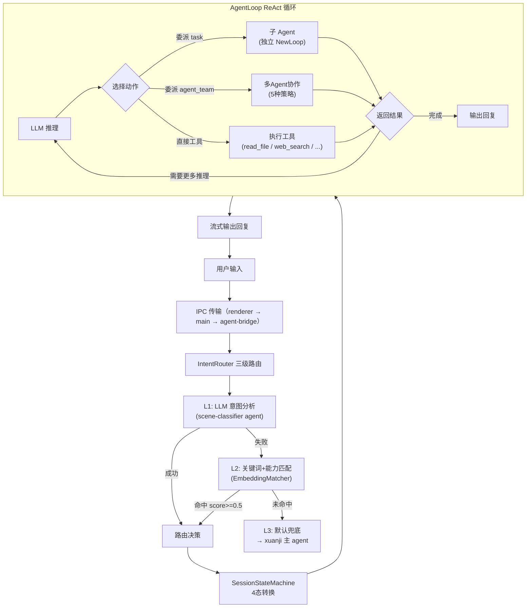

#### 三级意图路由

| 层级 | 机制 | 模型 | 耗时 | 成功率 |
|------|------|------|------|--------|
| L1 | LLM 意图分析 | qwen2.5-1.5b | ~500ms | ~70% |
| L2 | 关键词+能力匹配 | 纯本地计算 | <10ms | ~20% |
| L3 | 默认兜底 | — | 0ms | 100% |

L1 失败条件：LLM 不可用 / 超时 15s / JSON 解析失败 / 返回的 agent 不在 Registry 中。

### 2.2 会话状态机

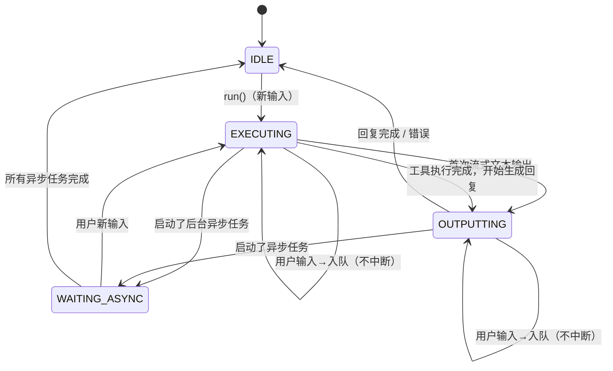

**关键设计决策**：

- `executing`/`outputting` 状态下用户新输入**仅入队不中断**（2025-05-07 修改）
- 中断保留给「停止按钮」→ 通过 `requestAbort()` 实现
- `outputting` 状态由**首次 `onText` 回调**手动设置，非自动

### 2.3 消息通道架构

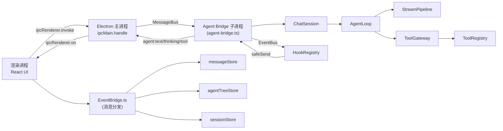

---

## 三、Agent 架构与协作模型

### 3.1 Agent 层级

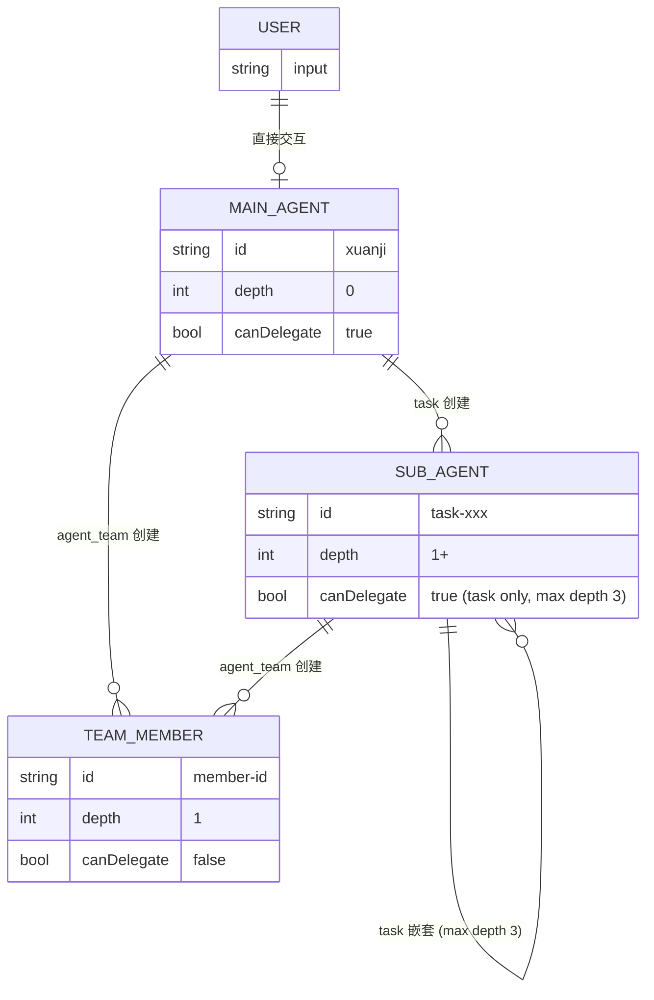

| 角色 | depth | task | agent_team | 场景 |
|------|-------|------|-----------|------|
| 主 Agent (xuanji) | 0 | ✅ (auto async) | ✅ (auto async) | 直接与用户交互 |
| 子 Agent | 1-2 | ✅ (auto sync, max depth 3) | ✅ | 执行委派任务 |
| Team 成员 | 1 | ❌ (工具白名单无 task) | ❌ (TeamContext 守卫) | 执行单元，不可再创建子 agent |

### 3.2 Agent 生命周期的 5 个状态

```
pending → running → success / failed → done
```

前端 `AgentStatus` 类型：
```
idle | pending | thinking | executing | responding | success | failed | done
```

### 3.3 agent_team 五种协作策略

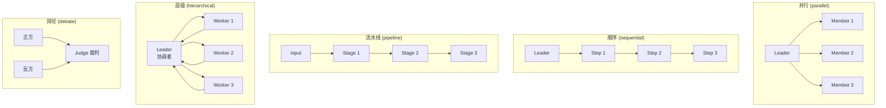

### 3.4 ACP 子进程隔离

所有有 `subAgentId` 的子 Agent 通过 ACP（Agent Communication Protocol）隔离到独立 `child_process.fork()` 中运行：

```
主进程 (Node.js)                        ACP Worker 1
AgentFactory.createAndRun()             AgentLoop.run()
  ├─ process.fork() ──────────────→      ├─ streamPipeline
  │   stdin/stdout JSONL 通信             ├─ ToolGateway
  │   event → process.send()             └─ 独立事件循环
  └─ AcpProcessManager (池化管理)
       ├─ maxConcurrent: 3
       ├─ 空闲 5 分钟回收
       └─ fallback: 同进程（仅工作路径兜底）
```

**关键保护机制**：ACP fallback 到同进程时，子 agent 的 text/thinking 必须通过 `setSuppressEventBus(true)` 屏蔽，防止泄露到前端对话框。

---

## 四、记忆系统

### 4.1 三层触发架构

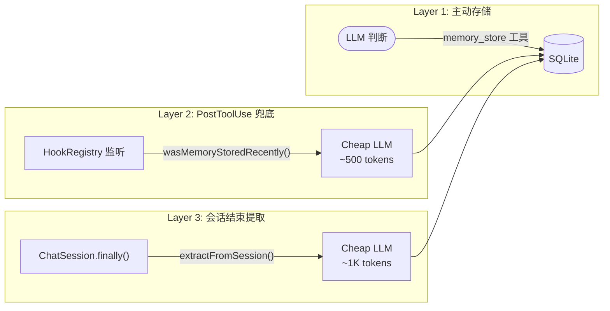

### 4.2 存储模型（8 表 + FTS5 + 语义索引）

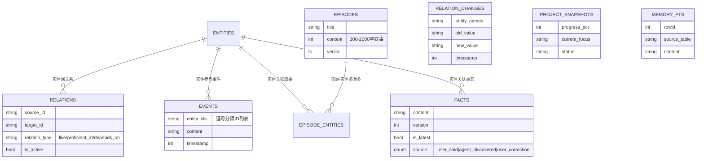

### 4.3 三层检索

| 层 | 注入时机 | Token 开销 | 内容 |
|----|----------|-----------|------|
| L0 被动注入 | 每次对话 | ~200 | 偏好实体 top-5 |
| L1 场景注入 | scene 加载时 | ~600 | scene_tag 匹配的事实+实体 |
| L2 主动搜索 | LLM 调用 `memory_search` | 按需 | query/type/scope/use_semantic |

**`active_context` 搜索**是核心创新：不依赖关键词，直接 SQL 查询近期目标/偏好/校正信息。

### 4.4 信息分解规则（核心设计决策）

用户输入「我不吃川菜，因为太辣了」不存为单条事实，而是分解为拓扑图：

```
entity(川菜) + entity(辣)
relation(用户 -不喜欢→ 川菜)
relation(用户 -不喜欢→ 辣)
relation(川菜 -具有属性→ 辣)
```

这样 LLM 可做多跳推理：用户不喜欢辣的 → 川菜辣 → 湘菜也辣 → 用户可能也不喜欢湘菜。

---

## 五、自学习与可扩展性

### 5.1 Learn 流程

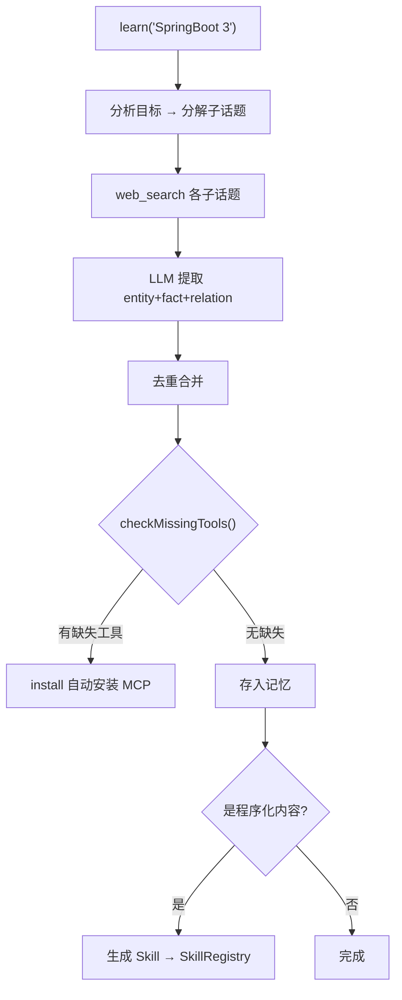

### 5.2 Install 流程

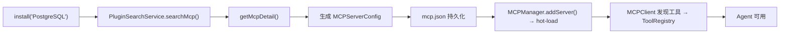

### 5.3 工具扩展模型

```
Tools 是静态的（read_file / bash / web_search / memory_store / ...）
新能力通过两种方式扩展：

1. MCP Server（外部）：
   Install → MCP 子进程 → 工具自动可用

2. Skill（内部）：
   Learn → 生成 Skill → 存入 skills/learned/
```

---

## 六、后台任务与调度

### 6.1 异步任务完成队列

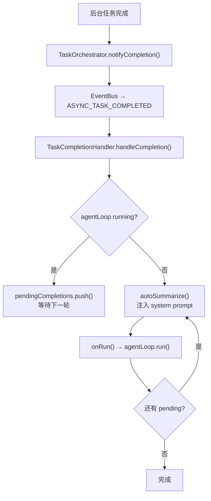

### 6.2 系统调度任务

| 任务 | 时间 | 职责 |
|------|------|------|
| subagent-cleanup | 每日 1:00 | 清理过期子 agent 结果文件 (>7d) |
| memory-maintenance | 每日 3:00 | 触发记忆维护 agent 执行去重/合并/清理 |
| idle-greeting | 每 30min 检查 | 用户 3 天未活跃 → 发送问候 |

### 6.3 定期任务执行

Scheduler 系统在设计上防止进程重启丢失任务：

1. 持久化 `scheduler_log` 表记录每次执行
2. 启动时计算 `[lastCheck, now]` 之间错过的执行点
3. 查 `scheduler_log` 防止重复执行

---

## 七、UI 架构 (前台)

### 7.1 前端 Store 架构

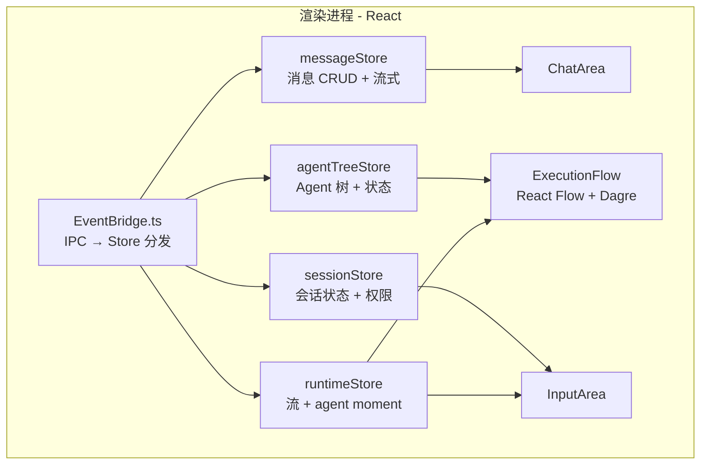

视觉风格: visionOS glassmorphism dark, DiceBear avataaars 头像, 大圆角, 最小化边框。

### 7.2 布局

| 面板 | 比例/宽度 |
|------|----------|
| 对话区 | flex-[2] |
| 工作空间 (ExecutionFlow) | flex-[2] |
| 文件树 | 220px 固定宽度 |
| 底部状态栏 | 系统资源监控 (CPU/内存, 每3s) |

---

## 八、竞品对比

### 8.1 整体对比矩阵

| 维度 | Xuanji | Hermes Agent | OpenCLAW | Claude Code | Cursor | Copilot | ChatGPT Desktop |
|------|--------|-------------|----------|-------------|--------|---------|----------------|
| **定位** | 个人 AI 代理 | 开源 AI agent 框架 | 开源 AI agent 框架 | CLI 编程助手 | IDE 编程助手 | IDE 插件 | 通用聊天 |
| **开发方** | Shibit (个人) | Nous Research | Nous Research | Anthropic | Cursor Inc. | GitHub/Microsoft | OpenAI |
| **开源** | ✅ MIT | ✅ MIT | ✅ 开源 | ❌ | ❌ | ❌ | ❌ |
| **Stars** | ~100s | 7.5k+ | 373k | — | — | — | — |
| **多 Agent 协作** | ✅ 5 种策略 | ✅ delegate_task | ✅ Agent 编排 | ❌ 单 agent | ❌ Composer 单流 | ❌ 单 agent | ❌ 对话模式 |
| **记忆系统** | ✅ 拓扑图+叙事 | ✅ 持久化记忆+可插拔 | ✅ 记忆 | ❌ 无 | ❌ 会话级 | ❌ | ❌ 会话级 |
| **技能/自学习** | ✅ Learn+Install | ✅ Skills (hub + 自动学习) | ✅ Skill-like agents | ❌ | ❌ | ❌ | ❌ |
| **工具扩展** | ✅ MCP + Skill | ✅ MCP + Plugin | ✅ MCP + Plugin | ✅ MCP | ❌ 插件生态 | ❌ 有限 | ❌ |
| **子进程隔离** | ✅ ACP | ✅ 同进程 | ✅ 同进程 | ❌ 同进程 | ✅ IDE 架构 | ✅ 同进程 | ✅ 原生 |
| **异步后台任务** | ✅ 可继续聊天 | ✅ cron + background | ✅ 后台任务 | ❌ 阻塞 | ❌ 阻塞 | ❌ 阻塞 | ❌ 阻塞 |
| **主动问候** | ✅ 空闲检测 | ✅ cron job | ✅ 类似 | ❌ | ❌ | ❌ | ❌ |
| **消息平台网关** | ❌ | ✅ 15+ 平台 | ✅ 多平台 | ❌ CLI only | ❌ IDE only | ❌ IDE only | ✅ 网页/App |
| **桌面 GUI** | ✅ Electron | ❌ CLI only | ❌ CLI only | ❌ CLI | ✅ IDE | ✅ IDE 插件 | ✅ |
| **CLI 模式** | ✅ (via Hermes) | ✅ 原生 CLI | ✅ 原生 CLI | ✅ | ❌ | ❌ | ❌ |
| **多平台** | ✅ Mac/Win/Linux | ✅ Mac/Win/Linux/WSL | ✅ 全平台 | ✅ Mac/Linux | ✅ Mac/Win/Linux | ✅ 全平台 | ✅ Mac/Win |
| **本地模型** | ✅ node-llama-cpp | ✅ Ollama/LM Studio | ❌ | ❌ | ❌ | ❌ | ❌ |
| **自定义 Agent** | ✅ YAML 配置 | ✅ Profiles + 多实例 | ✅ Agents 目录 | ❌ | ❌ | ❌ | ❌ GPTs |
| **IDE 集成** | ❌ | ✅ VS Code 扩展 | ✅ .vscode 集成 | ✅ VS Code/IDE | ✅ 原生 IDE | ✅ 原生 IDE | ❌ |
| **多种 provider** | ✅ 任何 OpenAI 兼容 | ✅ 20+ 提供商 | ✅ 多提供商 | ❌ Anthropic only | ❌ 有限 | ❌ GitHub CoPilot | ❌ OpenAI only |
| **MCP 管理** | ✅ hot-load | ✅ CLI 管理 | ✅ CLI 管理 | ✅ | ❌ | ❌ | ❌ |

### 8.2 编程能力对比

| 维度 | Xuanji | Claude Code | Cursor | Copilot |
|------|--------|-------------|--------|---------|
| **代码补全** | ❌ | ❌ | ✅ Tab | ✅ Tab |
| **内联编辑** | ❌ | ✅ | ✅ Cmd+K | ✅ Cmd+I |
| **项目理解** | ✅ 自读 + task 委派 | ✅ 文件遍历 | ✅ 索引 | ✅ 索引 |
| **代码审查** | ✅ agent_team code-review | ❌ | ❌ review 模式 | ❌ |
| **重构** | ✅ 多 agent 并行重构 | ✅ 单 agent | ✅ | ✅ |
| **测试生成** | ✅ 委派 + 并行 | ✅ | ✅ | ✅ |
| **Git 集成** | ✅ stash/branch/commit | ✅ | ✅ 内建 | ✅ |
| **plan/apply 模式** | ✅ plan_review 工具 | ✅ | ❌ | ❌ |

### 8.3 Xuanji vs Hermes vs OpenCLAW — 深度模块对比

OpenCLAW 和 Hermes Agent 由 Nous Research 开发，两者共享代码基础（Hermes 是 OpenCLAW 的下一代迭代，支持 `hermes claw migrate` 迁移命令）。Xuanji 是独立架构的 TypeScript 实现。三者同属「开源个人 AI agent」赛道，但每个模块的实现路径截然不同。

#### 8.3.1 多 Agent 协作

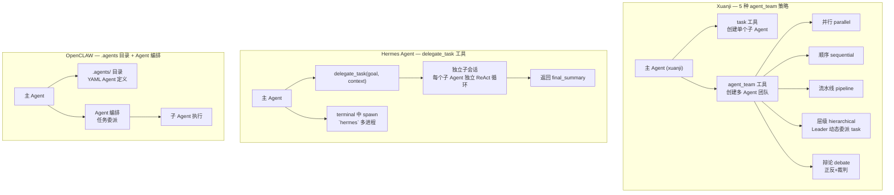

| 维度 | Xuanji | Hermes Agent | OpenCLAW |
|------|--------|-------------|----------|
| **协作机制** | `agent_team` 工具 + `task` 工具 | `delegate_task` 工具 + terminal spawn | `.agents` 目录 Agent 定义 + 编排 |
| **团队策略** | 5 种预定义策略（并行/顺序/流水线/层级/辩论） | 单一委派（goal+context → 子会话） | Agent 编排（机制类似） |
| **嵌套深度** | 主 agent(depth=0) → 子 agent(depth=1) → 子 agent(depth=2+, max depth 3) | 单层委派（delegate_task 不嵌套） | 单层 Agent 编排 |
| **辩论模式** | ✅ 正反+裁判，适合架构决策 | ❌ 无 | ❌ 无 |
| **层级协作** | ✅ Leader 可动态 task 委派给 Workers | ❌ 无 | ✅ 类似 |
| **并行执行** | ✅ agent_team parallel（同进程/ACP） | ✅ delegate_task 并行（同进程） | ✅ Agent 编排并行 |
| **成员角色** | ✅ 可配置 scene / tools / model | ❌ 子 agent 继承父配置 | ✅ 可配置 |
| **子进程隔离** | ✅ ACP child_process.fork() | ❌ 同进程 | ❌ 同进程 |

**Xuanji 劣势**：心智负担高——LLM 需要自己决定用 task 还是 agent_team，还要选哪种策略、配 scenes。对简单任务 over-engineering。ACP 进程启动有开销（~200ms），临时 agent 走 ACP 不如直接执行快。团队成员的工具集默认 undefined → 走默认注册表，LLM 不传 tools 时可能拿到不该有的工具。
**Hermes 劣势**：`delegate_task` 只有 goal+context 两种输入，无法指定子 agent 的角色/场景/工具集。子 agent 继承父配置不能定制。terminal spawn 的模式需要手动管理 tmux session，体验粗糙。
**OpenCLAW 劣势**：与 Hermes 类似，且 .agents 目录的管理模式依赖 LLM 自己去按需发现和编排，没有 Xuanji 的 `list_scenes` 辅助——LLM 需要记得有哪些 agent 可用，容易遗忘或使用不当。

#### 8.3.2 异步执行与后台任务

| 维度 | Xuanji | Hermes Agent | OpenCLAW |
|------|--------|-------------|----------|
| **异步任务** | ✅ task 工具 depth=0 自动 async | ✅ `cronjob` 工具 + `background` slash cmd | ✅ 后台任务支持 |
| **主 agent 非阻塞** | ✅ 后台运行时用户可继续聊天 | ✅ 后台运行时不阻塞新输入 | ✅ 类似 |
| **完成通知** | ✅ TaskCompletionHandler + `pendingCompletions` 队列 + 自然语言自述式注入 | ❌ 不主动通知（需用户 `/queue` 检查） | ❌ 不主动通知 |
| **完成自动汇报** | ✅ autoSummarize() 自动注入 system prompt 触发主 agent 汇报 | ❌ 无 | ❌ 无 |
| **队列管理** | ✅ 多个后台任务完成时排队逐一汇报 | ❌ 单次执行 | ❌ 单次执行 |
| **cron 调度** | ✅ 内建 Scheduler + 持久化 + catch-up on restart | ✅ `hermes cron create` CLI 命令 | ✅ cron 支持 |
| **系统自维护任务** | ✅ subagent-cleanup / memory-maintenance 定时执行 | ❌ 无 | ❌ 无 |
| **Catch-up 防丢** | ✅ scheduler_log 表 + 启动时扫描 `[lastCheck, now]` 错过的执行 | ❌ 进程重启丢失 setTimeout | ❌ 类似 |
| **isRunning 保护** | ✅ 主 agent 忙时后台结果入队等待，不打断当前交互 | ❌ 无 | ❌ 无 |

**Xuanji 劣势**：异步链路过长引入时序 bug 风险——`isRunning` callback 指向错误（曾指向不存在的 `ExecutionEngine._running` 导致后台完成时主 agent 忙碌也强行触发汇报）、`TaskCompletionHandler` 曾被移除又需手动重装。ACP worker 文件路径在 dev 模式下容易找不到，fallback 到同进程时若未 `setSuppressEventBus(true)` 则子 agent 内容泄露到前端。autoSummarize 递归调用 `onRun` 有循环调用风险（虽用 `isAutoSummarizeRun` 保护但容易漏）。
**Hermes 劣势**：background 和 cron job 完成**不主动通知用户**，需要用户手动 `/queue` 检查或等下次交互时才能看到结果。cron 使用 `setTimeout`，进程重启后全部丢失——没有持久化调度日志和 catch-up 机制。没有 `isRunning` 保护，后台任务完成时若 agent 正在回复仍会执行。
**OpenCLAW 劣势**：与 Hermes 相同。后台任务和 cron 是一次性执行，没有完整的完成→队列→自动通知链路。

#### 8.3.3 动态 Prompt 系统

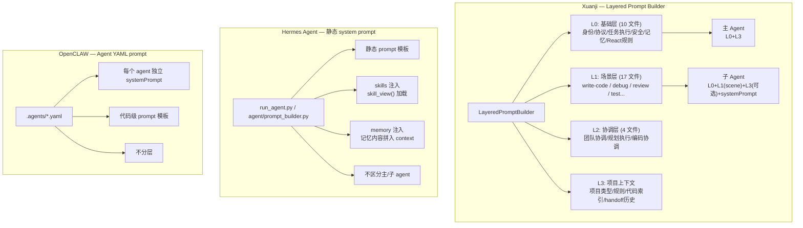

| 维度 | Xuanji | Hermes Agent | OpenCLAW |
|------|--------|-------------|----------|
| **架构** | 4 层（L0/L1/L2/L3）分层构建 | 单层静态 prompt + skill/memory 拼接 | 单层 YAML systemPrompt |
| **场景切换** | ✅ L1 按 scene 懒加载，`list_scenes` 发现 | ❌ 无 scene 概念 | ❌ 无 scene 概念 |
| **子 agent prompt** | ✅ L0(排除 main-agent) + L1(scene) + L3 + agent systemPrompt | ❌ 简单拼接 | ✅ YAML 定义 |
| **prompt 语言** | 全英文（L0/L1/L2 YAML 文件） | 英文 | 英文 |
| **记忆注入** | ✅ L0 被动注入 + L1 scene 注入 + L2 主动搜索 | ✅ memory 文本拼入 | ✅ 类似 |
| **复杂度** | 高（31 个 YAML 文件 + 代码组件） | 中（几个 prompt 模板文件） | 低（YAML 单个 agent 定义） |
| **热替换** | ✅ `applyAgentConfig()` 运行时替换 provider/systemPrompt/toolRegistry | ❌ 需要 reset session | ❌ 需要重启 |
| **PromptComposer 死代码** | ⚠️ 曾有过死代码历史（PromptComposer 从未被调用） | — | — |

**Xuanji 劣势**：31 个 YAML 文件的维护负担极重——新增一个 L1 scene 需要写 YAML + 在两个用户目录同步 + 验证 LayeredPromptBuilder 正确加载。曾发生过 `PromptComposer` 完全死代码而无人发现的严重问题（所有 L0/L1/L2 prompt 从未被加载到子 agent）。热替换 `applyAgentConfig()` 虽然灵活但容易漏传参数（model 扁平结构和 provider 嵌套结构混用导致配置断裂）。`buildMainPrompt` 现在完全覆盖 `agentCfg.systemPrompt`，YAML 里的 systemPrompt 内容丢了。
**Hermes 劣势**：没有 scene 概念，所有场景共享同一套 prompt 模板。子 agent 的 prompt = 父 prompt 的简单等位替换，无法针对任务类型差异化加载行为指导。记忆和 skill 以文本拼接方式混入 context，没有结构化的层次。修改 prompt 需要改 Python 代码，没有 Xuanji 的 YAML 配置化。
**OpenCLAW 劣势**：与 Hermes 类似。每个 agent 的 YAML 定义虽然是独立文件，但不存在层级组合——子 agent 拿不到父 agent 的 L0 规则，每份 YAML 必须自己写全所有规则，容易遗漏。

#### 8.3.4 记忆系统

| 维度 | Xuanji | Hermes Agent | OpenCLAW |
|------|--------|-------------|----------|
| **存储引擎** | SQLite 8 表 + FTS5 + 本地 ONNX 384d 语义索引 | SQLite（内置）/ Honcho / Mem0 可插拔 | SQLite |
| **数据结构** | 拓扑图（entity + relation）+ 事实 + 事件 + 叙事 | 键值对 + profile 字段 | 简单记忆键值 |
| **多跳推理** | ✅ 拓扑图支持（川菜→辣→湘菜） | ❌ 无图结构，靠 LLM 自推理 | ❌ 无图结构 |
| **三层触发** | ✅ LLM 主动 store + PostToolUse 兜底 + session-end 提取 | ✅ 工具调用 + 自动提取 | ✅ 类似 |
| **信息分解** | ✅ 输入「我不吃川菜，因为太辣了」→ 5 条 entity+relation | ❌ 存为 flat string | ❌ 存为 flat string |
| **主动上下文** | ✅ `active_context` 搜索（不靠关键词，SQL 直接查目标/偏好） | ❌ 关键词匹配 | ❌ 关键词匹配 |
| **叙事记忆** | ✅ episodes 表 + episode_entities 多对多 + 语义搜索 | ❌ 无 | ❌ 无 |
| **自动维护** | ✅ 每日 memory-maintenance agent 做去重/合并/链接/清理 | ❌ 无 | ❌ 无 |
| **实体关系变更追踪** | ✅ relation_changes 表 + is_active 软删除 | ❌ 无 | ❌ 无 |
| **FTS5 全文搜索** | ✅ unicode61 分词器 | ✅ SQLite FTS | ✅ SQLite FTS |
| **场景标签** | ✅ scene_tag `,tag,` 格式 | ❌ 无 | ❌ 无 |

**Xuanji 劣势**：架构复杂度过高——8 张 SQLite 表 + FTS5 触发器 + 本地 ONNX 模型 + 三层触发 + 每日自动维护 agent，部署和维护成本远高于简单 KV 方案。信息分解依赖 LLM 精度，如果 LLM 没有正确分解「我不吃川菜」为 entity+relation 拓扑，三跳推理链条断裂。`active_context` 搜索的 SQL 查询是硬编码的（30d 内目标/偏好/校正），策略不够灵活。叙事记忆（episodes）的使用场景狭窄，300-2000 字的叙事在实际对话中触发频率极低。
**Hermes 劣势**：记忆以键值对和 profile 字段为主，没有实体-关系图结构，不支持多跳推理。LLM 需要自己从存储的 flat string 中做推理。没有主动上下文搜索（仅关键词匹配），当用户说「朋友请我吃湘菜」时，不会自动关联到「最近在减肥」。没有自动维护机制，冗余记忆累积不清理。没有叙事记忆。
**OpenCLAW 劣势**：与 Hermes 相近。记忆系统更基础，主要是简单的键值存储，不区分事实/事件/实体。

#### 8.3.5 Skills + MCP 生态

| 维度 | Xuanji | Hermes Agent | OpenCLAW |
|------|--------|-------------|----------|
| **Skills 定义** | SKILL.md (YAML frontmatter + markdown) | 类似 SKILL.md 格式 | `.agents` 目录 |
| **Skill Hub** | 本地文件系统（`skills/learned/` + `skills/installed/`） | ✅ 在线 Hub（`hermes skills browse`） | ✅ 在线 Hub |
| **自动生成 Skill** | ✅ LearnTool 自动生成 + 注册 | ✅ 运行完成后自动保存 | ✅ 类似 |
| **Skill 更新** | ✅ 使用后自动 patch（`skill_manage`） | ✅ `hermes skills check/update` | ✅ 类似 |
| **MCP 服务器** | ✅ MCPManager + hot-load + crash isolation | ✅ `hermes mcp add/list/remove` | ✅ MCP 支持 |
| **MCP 热加载** | ✅ 添加后立即可用 | ❌ 需要 reset session | ❌ 需要 reset |
| **Plugin 系统** | ❌ 无 Plugin 系统 | ✅ Plugin 系统（`hermes plugins install`） | ✅ Plugin 系统 |
| **MCP 数量/生态** | 小（个人项目） | 大（社区 + Hub） | 极大（373k stars 社区） |
| **Skill 更新机制** | ✅ 使用中自动 patch 修复 | ✅ CLI 检查更新 | ✅ CLI 检查更新 |

**Xuanji 劣势**：没有在线 Skill Hub——所有 skill 存储在本地文件系统，无法从社区发现和安装。没有 Plugin 系统，扩展性完全依赖 MCP。Skill 发布和分发机制缺失，无法共享给其他人。LearnTool 自动生成的 skill 质量依赖 LLM 精度，有时生成不完整或不可用的 skill。MCPManager 的 hot-load 虽然灵活但 crash 后恢复逻辑不完善。
**Hermes 劣势**：MCP 添加后需要 reset session 才能生效，hot-reload 不如 Xuanji 即时。Plugin 系统虽然存在但文档不够完善，社区贡献 plugin 的流程不透明。`hermes skills check` 需要手动触发，不会在运行时自动修复过时的 skill。
**OpenCLAW 劣势**：与 Hermes 类似。虽然社区规模最大，但 `.agents` 目录的 skill 格式与 Hermes 不完全兼容，生态碎片化。

#### 8.3.6 综合定位差异

```
                      Agent 自治程度（多 agent / 异步 / 记忆 / 自学习）
                      ▲
                      │
              Xuanji  │
        OpenCLAW ─────┤
        Hermes  ──────┤
                      │
                      │
         ─────────────┼────────────────▶ 社区生态（Stars / Hub / 插件）
                      │
                      │
                      │
                      │
                      ▼
```

**Xuanji** — 架构最复杂、功能最全（5 种协作策略、拓扑图记忆、ACP 隔离、完整异步链路），但社区最小。
**Hermes Agent** — 最平衡（20+ provider、15+ 消息平台、Skill Hub、Plugin），Python 生态成熟。
**OpenCLAW** — 社区最大（373k stars），功能与 Hermes 接近但不一定有 Hermes 最新的特性迭代。

三者共享同一个核心愿景——「开源个人 AI 代理」——但 Xuanji 在**多 agent 协作和记忆系统**上走得更深，Hermes/OpenCLAW 在**平台覆盖和社区生态**上走得更广。

### 8.4 Xuanji 的劣势

1. **编程 IDE 集成缺失**
   - 没有 Cursor 那样的内联编辑、代码补全
   - 依赖文件操作工具 + token 遍历，大项目效率低于索引方案
   - 没有 Cmd+K/Cmd+I 快捷编辑

2. **开源社区规模小**
   - Cursor/Claude Code 有大量用户反馈迭代
   - Xuanji 目前核心开发者较少

3. **架构复杂度高**
   - 3 层 prompt 系统、ACP 进程池、EventBus+HookRegistry 两套事件
   - 新手贡献者上手门槛高

4. **运营成熟度**
   - 没有 app store / 市场
   - 缺少 MCP 插件精选列表和评分系统

### 8.5 定位矩阵

```
                      IDE 集成深度
                      ▲
                      │
              Cursor  │
              Copilot │
                      │
         ─────────────┼──────────────▶  Agent 自治程度
                      │
         Claude Code  │
                      │
               Xuanji │
                      │
                      ▼
```

Xuanji 在最右上角：最高的 Agent 自治程度（多 agent 协作、自学习、记忆），但 IDE 集成深度低于 Cursor/Copilot。

Claude Code 在中间偏右：Agent 自治度中等（单 agent ReAct），IDE 集成度低（纯 CLI）。

### 8.6 用户画像对比

| 用户类型 | 首选工具 | 原因 |
|---------|---------|------|
| 习惯 VS Code 的开发者 | Cursor / Copilot | IDE 内编辑体验最优 |
| 喜欢 CLI 的开发者 | Claude Code / Xuanji CLI | 终端工作流 |
| 需要复杂架构分析的开发者 | Xuanji | 多 agent 辩论+并行委派 |
| 想要「私人 AI 助手」的用户 | Xuanji | 记忆+主动问候+自学习 |
| 纯聊天需求 | ChatGPT Desktop | 交互最简单 |

---

## 九、Xuanji 的演进路径

```
Phase 1 (当前 v0.9)     Phase 2                    Phase 3
├── AgentLoop ReAct      ├── IntentRouter 活起来      ├── 第三方 Agent 市场
├── agent_team 5 策略    ├── SessionStateMachine      ├── GUI 编辑器
├── 记忆系统 v2          ├── 事件架构统一               ├── 团队协作
├── ACP 子进程隔离        ├── store 拆分               ├── MCP 应用商店
├── 桌面 GUI v1          ├── 热键+内联编辑             └── 性能优化
├── 自学习系统            └── 项目索引
└── 调度系统
```

---

## 十、总结

**Xuanji 的本质**不是「又一个人工智能编码助手」——它试图解决的问题是：

> **如何让 AI 不仅仅回答问题或写代码，而是成为一个有记忆、能学习、能主动关注、能协调多个专业 agent 一起工作的「数字助手」。**

它的核心差异化来自：
1. 多 agent 协作（5 种策略，辩论做架构决策）
2. 拓扑图记忆（非简单 KV 存储）
3. 异步并行（后台工作不阻塞对话）
4. 自学习（学会了就直接用）

最大的瓶颈在 IDE 集成深度和社区规模——一个日用小改进缺失，另一个是时间问题。
