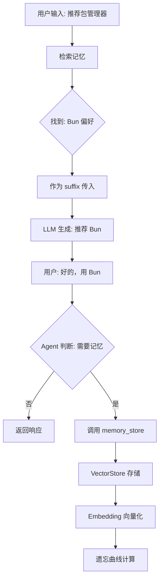

# 记忆驱动会话架构设计（最终版）

## 设计日期
2026-03-16

## 设计原则

从**机械式归档**转向**智能主动记忆**：
- ❌ 固定规则（每 N 轮自动归档）
- ✅ Agent 智能判断（何时需要记忆）
- ✅ 工具驱动（调用 memory_store）
- ✅ 向量检索（记忆作为上下文）

---

## 核心设计（4 点）

### 1. **Agent 主动记忆**

**原理**：通过 System Prompt 引导，Agent 判断何时需要记忆。

**实现位置**：`src/core/prompt/components/l0-identity.ts`

**System Prompt（已增强）**：
```markdown
## When to Store Memory

Call `memory_store` immediately when you observe:

1. **Personal Context**: User shares preferences, habits, background
2. **Important Decisions**: User makes a choice or expresses strong opinion
3. **Project Knowledge**: Key information about current project
4. **Action Items**: User mentions TODO, deadline, commitment
5. **Learning Points**: User corrects you or shares knowledge
6. **Task Outcomes**: After completing a task, store key findings

## How to Store Memory

\`\`\`typescript
memory_store({
  content: "Concise knowledge point (1-2 sentences)",
  tags: ["category", "subcategory", "keywords"],
  metadata: {
    importance: "high" | "medium" | "low",
    source: "user_stated" | "task_completed" | "inferred"
  }
})
\`\`\`

## Task Completion Protocol

When you finish a task:
1. **Review** what was accomplished and learned
2. **Store memory** if important insights were revealed
3. **Confirm** to user: "✓ Task completed. Remembered: [summary]"
```

**工具注册**：
- `memory_store` 和 `memory_search` 已在 `xuanji.json5` 中注册
- 属于 `life` 场景工具（ToolCategories.ts）

**效果**：
- ✅ Agent 自主判断何时记忆
- ✅ 即时存储（不等待批量归档）
- ✅ 颗粒度更细（单个知识点）

---

### 2. **任务完成后自动总结**

**原理**：通过 System Prompt 引导，Agent 在任务完成后总结学习点。

**实现位置**：同上（l0-identity.ts 的 Task Completion Protocol）

**触发时机**：
- Agent 完成 multi-step 任务
- todo_update 标记任务为 completed
- 执行成功后发现重要模式

**示例对话**：
```
User: 帮我配置 Tailwind CSS

Agent: [执行配置...]

Agent: ✓ 任务完成。Tailwind CSS 已配置，使用自定义主题色。
      ✓ Remembered: Project uses TailwindCSS with custom color scheme in tailwind.config.ts

[自动调用 memory_store({
  content: "Project uses TailwindCSS with custom color scheme in tailwind.config.ts",
  tags: ["project", "tech-stack", "tailwindcss"],
  metadata: { importance: "medium", source: "task_completed" }
})]
```

**效果**：
- ✅ 自动积累项目知识
- ✅ 无需用户手动触发
- ✅ 记忆与任务关联

---

### 3. **向量数据库 + 遗忘曲线**

**实现位置**：
- `src/embedding/VectorStore.ts` - 向量存储（SQLite + sqlite-vec）
- `src/memory/HybridRetriever.ts` - 混合检索
- `src/embedding/EmbeddingService.ts` - Embedding 生成（Xenova/transformers）

**向量检索流程**：
```
1. 用户输入 → Embedding 向量化
2. VectorStore.search() → 向量相似度检索
3. 混合评分：
   - 向量相似度：50%
   - 关键词匹配：20%
   - 时效性（遗忘曲线）：20%
   - 访问频次：10%
4. 返回 Top-K 记忆条目
```

**遗忘曲线公式**：
```typescript
recencyScore = 0.5^(ageInDays / halfLife)

// 默认 halfLife = 30 天
//  1 天前：score = 0.98
// 15 天前：score = 0.71
// 30 天前：score = 0.50
// 90 天前：score = 0.13
```

**配置参数**：
```typescript
const memoryManager = new MemoryManager({
  decayHalfLifeDays: 30,  // 遗忘曲线半衰期
  longTermMaxEntries: 2000, // 最大记忆条目数
  vectorSearchTopK: 20,     // 向量检索数量
});
```

**效果**：
- ✅ 语义相似度检索（不依赖关键词）
- ✅ 旧记忆权重降低（避免过时信息）
- ✅ 高频记忆权重提升

---

### 4. **记忆作为上下文传入**

**实现位置**：`src/core/chat/ChatSession.ts` (488-503 行)

**已有实现**：
```typescript
// runSingleAgent() 方法中
if (this.memoryManager) {
  // 1. 检索相关记忆
  const memories = await this.memoryManager.retrieve(userMessage, {
    maxResults: 10,
    minConfidence: 0.3,
  });

  // 2. 格式化为 Markdown
  if (memories.length > 0) {
    const memorySummary = this.memoryManager.formatForPrompt(memories);

    // 3. 注入到 system prompt（作为 suffix）
    this.agentLoop!.getMessageManager().setSystemPromptSuffix(
      memorySummary,
      'memory'
    );
  }
}
```

**formatForPrompt 输出格式**：
```markdown
### Relevant Past Context
- **[用户偏好]** User prefers Bun over npm for package management
- **[项目知识]** Project uses TailwindCSS with custom color scheme
- **[重要决策]** Decided to use Vite for build tool instead of Webpack
```

**LLM 看到的上下文**：
```
System Prompt:
[L0 Core Identity]
[L1 Coding Guide]
...

### Relevant Past Context
- **[用户偏好]** User prefers Bun over npm
- **[项目知识]** Project uses TailwindCSS
---

User: 帮我安装一个新的库
```

**效果**：
- ✅ 每次对话前自动检索
- ✅ 个性化响应（基于历史偏好）
- ✅ 上下文连续性（跨会话记忆）

---

## 数据流图



---

## 会话系统简化

### SessionSnapshot（最终版）

```typescript
{
  metadata: SessionMetadata,

  // 记忆驱动字段
  summary?: string,          // LLM 生成的会话摘要
  recentMessages: Message[], // 最近 10 条消息
  memoryRefs?: string[],     // 该会话产生的记忆 ID

  // 向后兼容（旧会话）
  messages: Message[],       // 新会话为 []
}
```

### SessionManager 职责

| 职责 | 是否保留 | 说明 |
|------|---------|------|
| save() | ✅ | 保存会话摘要 + 最近消息 |
| resume() | ✅ | 恢复会话 + 检索记忆 |
| ~~archiveMessagesToMemory()~~ | ❌ | Agent 主动调用 memory_store |
| ~~shouldAutoArchive()~~ | ❌ | 不需要固定规则 |

**简化后的配置**：
```typescript
const sessionManager = new SessionManager({
  memoryDriven: {
    enabled: true,
    keepRecentMessages: 10,        // 保留最近 N 条消息
    generateSummaryOnSave: true,   // 保存时生成摘要
  },
  provider: anthropicProvider,     // 用于生成摘要
  memoryManager: memoryManager,    // 用于检索记忆
});
```

**移除的配置**：
- ❌ `archiveEveryNTurns`（不再需要）

---

## 架构对比

| 维度 | 旧架构（会话归档） | 新架构（Agent 主动记忆） |
|------|------------------|----------------------|
| **决策者** | SessionManager（固定规则） | Agent（智能判断） |
| **触发时机** | 每 N 轮批量归档 | 任何时刻（即时） |
| **粒度** | 批量消息 | 单个知识点 |
| **工具** | 后台自动归档 | memory_store（显式调用） |
| **用户感知** | 无感知（黑盒） | 有反馈（"✓ Remembered"） |
| **符合哲学** | ❌ 机械被动 | ✅ 智能主动 |
| **上下文构建** | 会话历史 | 记忆检索 |

---

## 实施检查清单

### ✅ 已完成

- [x] System Prompt 增强（l0-identity.ts）
  - When to Store Memory
  - How to Store Memory
  - Task Completion Protocol
- [x] 工具注册（xuanji.json5）
  - memory_store
  - memory_search
- [x] 向量检索（HybridRetriever）
  - 混合评分
  - 遗忘曲线
- [x] 记忆上下文注入（ChatSession）
  - 每次输入前检索
  - formatForPrompt 格式化
  - setSystemPromptSuffix 注入
- [x] **简化 SessionManager**（2026-03-16）
  - 移除 `archiveMessagesToMemory()` 方法
  - 移除 `shouldAutoArchive()` 方法
  - 移除 `archiveEveryNTurns` 配置（已不存在于接口定义）
  - 移除 `archivedTurns` 状态（已随方法删除）

### ⏳ 待完成

- [ ] **更新类型定义**
  - SessionManagerOptions 移除 archiveEveryNTurns
  - MemoryDrivenConfig 移除 archiveEveryNTurns

- [ ] **测试验证**
  - Agent 是否主动调用 memory_store
  - 记忆检索是否正常工作
  - 遗忘曲线是否生效
  - 任务完成后是否总结

### 🔍 可选优化

- [ ] 记忆质量评估（人工标注）
- [ ] 摘要质量优化（Prompt Engineering）
- [ ] 向量检索性能优化
- [ ] 记忆去重机制

---

## 配置建议

### 开发环境
```typescript
{
  memoryDriven: {
    enabled: true,
    keepRecentMessages: 20,      // 保留更多上下文
    generateSummaryOnSave: false, // 禁用摘要（加快调试）
  },
  decayHalfLifeDays: 7,          // 更短的半衰期（测试遗忘曲线）
}
```

### 生产环境
```typescript
{
  memoryDriven: {
    enabled: true,
    keepRecentMessages: 10,       // 平衡性能和上下文
    generateSummaryOnSave: true,  // 生成摘要
  },
  decayHalfLifeDays: 30,          // 标准半衰期
  longTermMaxEntries: 2000,       // 限制记忆数量
}
```

---

## 示例场景

### 场景 1：用户偏好记忆

```
[第 1 次对话]
User: 我更喜欢用 Bun 而不是 npm
Agent: 好的，我会记住这个偏好。
      [自动调用 memory_store({
        content: "User prefers Bun over npm for package management",
        tags: ["preference", "tools", "package-manager"],
        metadata: { importance: "high", source: "user_stated" }
      })]
      ✓ Remembered: User prefers Bun over npm

---

[第 2 次对话 - 3 天后]
User: 帮我安装 lodash
Agent: [检索记忆 → 找到 "User prefers Bun"]
      [作为上下文传入]
      好的，我用 Bun 给你安装：
      \`\`\`bash
      bun add lodash
      \`\`\`
```

### 场景 2：任务完成总结

```
User: 帮我配置 ESLint

Agent: [执行多步任务...]
      1. 安装 ESLint
      2. 创建 .eslintrc.json
      3. 配置 rules

      ✓ 任务完成。ESLint 已配置，使用 Airbnb 规则集。

      [自动调用 memory_store({
        content: "Project uses ESLint with Airbnb style guide, configured in .eslintrc.json",
        tags: ["project", "linting", "eslint", "airbnb"],
        metadata: { importance: "medium", source: "task_completed" }
      })]

      ✓ Remembered: ESLint configuration details
```

### 场景 3：跨会话连续性

```
[会话 1 - 周一]
User: 我在做一个电商项目，用 Next.js
Agent: ✓ Remembered: Working on e-commerce project using Next.js

---

[会话 2 - 周三]
User: 帮我添加购物车功能
Agent: [检索记忆 → 找到 "e-commerce project" + "Next.js"]
      好的，我会在 Next.js 项目中添加购物车功能...
      [基于项目上下文生成代码]
```

---

## 总结

### 核心优势

1. **智能化**：Agent 自主判断，而非机械规则
2. **即时性**：实时记忆，而非批量归档
3. **个性化**：记忆驱动响应，而非通用回复
4. **连续性**：跨会话记忆，而非孤立对话

### 实施路径

1. ✅ **Phase 1**：增强 System Prompt（已完成）
2. ⏳ **Phase 2**：简化 SessionManager（清理归档逻辑）
3. 🔜 **Phase 3**：测试验证（Agent 主动记忆行为）
4. 🔜 **Phase 4**：优化迭代（质量评估、性能调优）

### 下一步

1. **清理代码**：移除 SessionManager 的归档方法
2. **测试验证**：运行一次完整对话，观察 Agent 是否主动调用 memory_store
3. **用户反馈**：收集实际使用中的记忆质量和准确性
