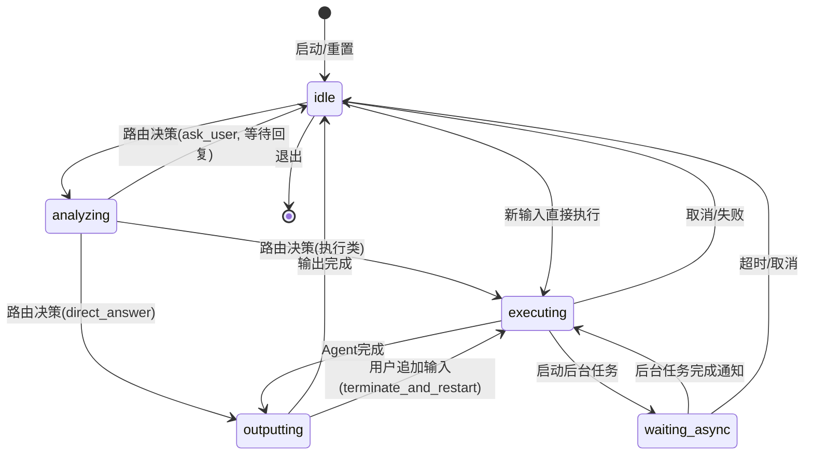
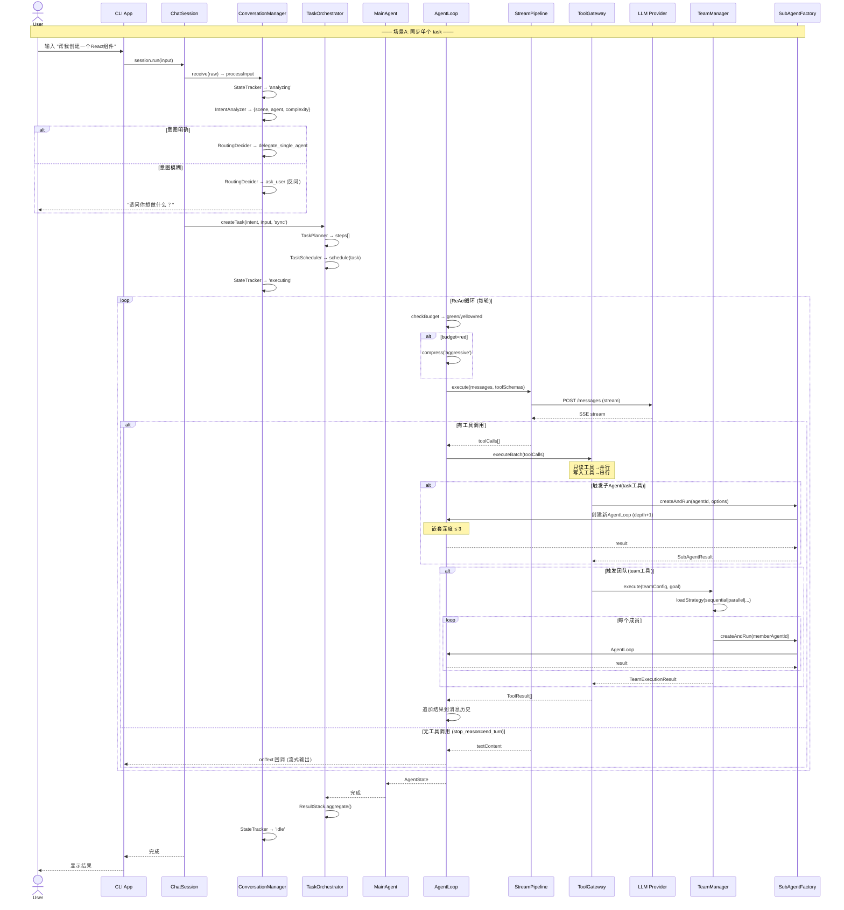
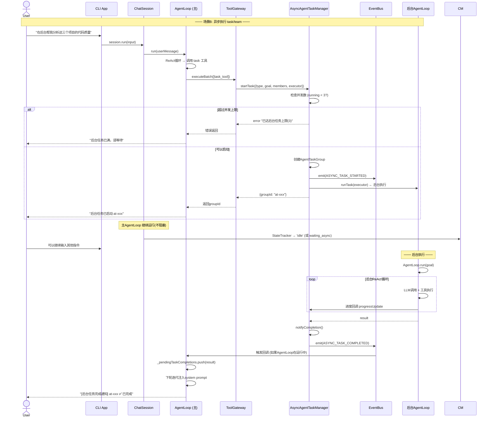
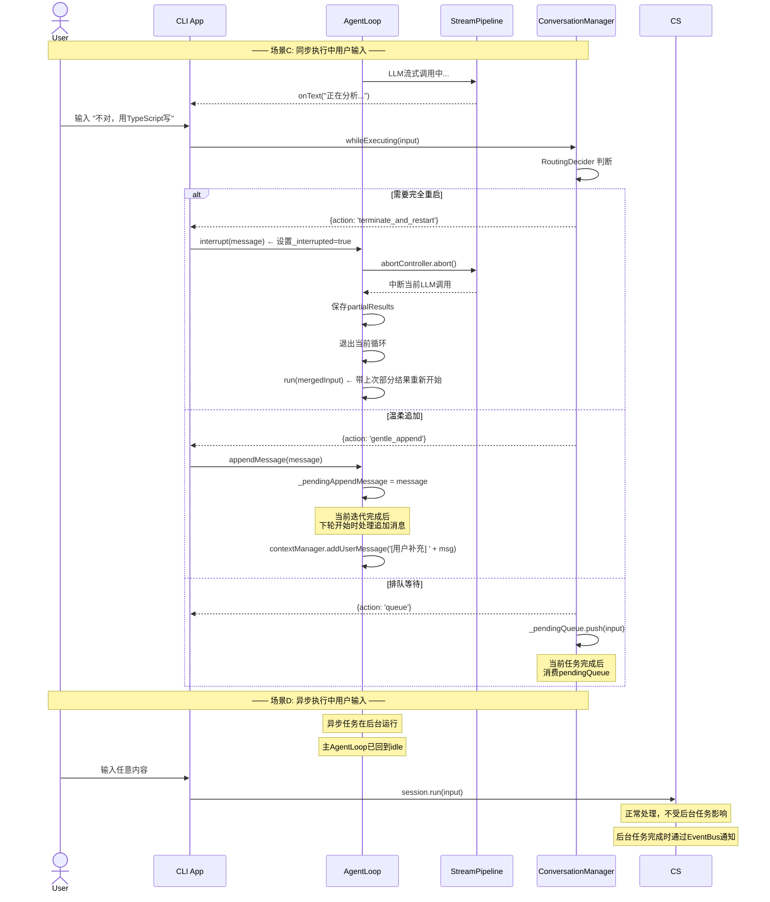
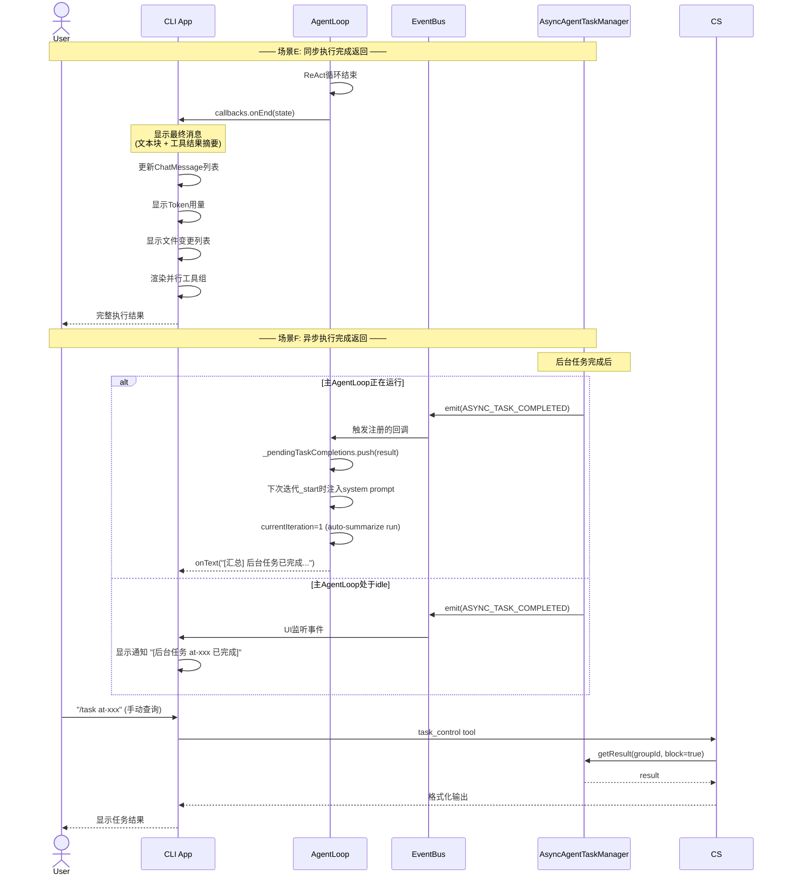
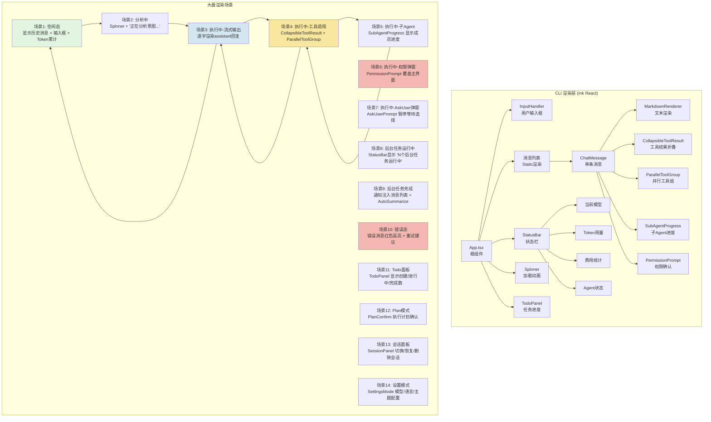
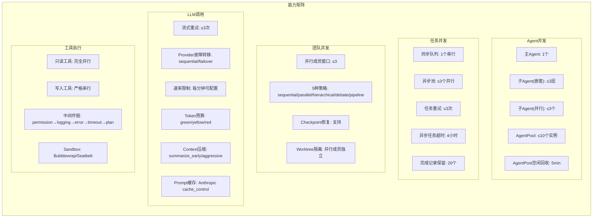
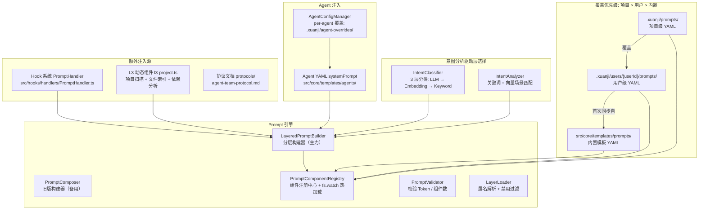

# Xuanji 业务场景全景分析

> 生成日期：2026-05-02 | 基于 `feature/async-agent-task` 分支

---

## 一、核心 ER 图 — 组件关系全景

```mermaid
erDiagram
    ChatSession ||--|| ConversationManager : "对话生命周期"
    ChatSession ||--|| TaskOrchestrator : "任务编排"
    ChatSession ||--|| MainAgent : "主Agent驱动"
    ChatSession ||--|| DependencyContainer : "DI容器"

    ConversationManager ||--|| InputReceiver : "输入解析"
    ConversationManager ||--|| IntentAnalyzer : "意图分析"
    ConversationManager ||--|| StateTracker : "状态机"
    ConversationManager ||--|| RoutingDecider : "路由决策"
    ConversationManager ||--|| ResponseDispatcher : "响应分发"

    StateTracker {
        string state "idle|analyzing|executing|outputting|waiting_async"
    }

    RoutingDecider {
        string action "delegate_single|delegate_team|run_main|direct_answer|execute_async|ask_user"
    }

    TaskOrchestrator ||--|| TaskPlanner : "步骤规划"
    TaskOrchestrator ||--|| TaskScheduler : "同步异步队列"
    TaskOrchestrator ||--|| ExecutionEngine : "逐步执行"
    TaskOrchestrator ||--|| ResultStack : "结果聚合"

    TaskScheduler {
        array syncQueue "串行队列"
        array asyncPool "并发池 max=3"
    }

    MainAgent ||--|| AgentLoop : "ReAct循环"
    MainAgent ||--|| IntentClassifier : "3层意图分类"
    MainAgent ||--|| LayeredPromptBuilder : "分层提示构建"

    AgentLoop ||--|| ContextManager : "上下文管理"
    AgentLoop ||--|| StreamPipeline : "流式管道"
    AgentLoop ||--|| ToolGateway : "工具网关"

    ContextManager {
        int maxTokens "最大Token数"
        int reserveForOutput "输出预留"
        function checkBudget "green|yellow|red"
        function compress "summarize_early|aggressive"
    }

    StreamPipeline {
        int maxRetries "3"
        function execute "LLM调用+重试"
        function processStream "事件分发"
    }

    ToolGateway {
        function executeBatch "只读并行+写入串行"
    }

    AgentLoop ||--o| AsyncAgentTaskManager : "后台任务事件"
    AsyncAgentTaskManager {
        int maxConcurrent "3"
        int maxLifetimeMs "4小时"
        int maxCompletedTasks "20"
    }

    TeamManager ||--|| SubAgentFactory : "子Agent创建"
    TeamManager {
        string strategy "sequential|parallel|hierarchical|debate|pipeline"
        int maxParallelMembers "3 (滑动窗口)"
    }

    SubAgentFactory {
        int MAX_CONCURRENT_SUBAGENTS "3"
        int MAX_NESTING_DEPTH "3"
        int DEFAULT_TIMEOUT "5min"
    }

    AgentFactory ||--|| AgentPool : "Agent池 max=10"

    EventBus {
        array log "200条环形"
        function emit "异步+优先级"
        function emitSync "即发即弃"
    }

    ProviderManager ||--|| ProviderFactory : "适配器工厂"
    ProviderManager ||--|| ProviderPool : "实例池"
    ProviderManager ||--|| FallbackManager : "故障转移"
    ProviderManager ||--|| RateLimitManager : "速率限制"

    PermissionController ||--|| FileGuard : "文件风险"
    PermissionController ||--|| CommandGuard : "命令风险"
    PermissionController ||--|| PolicyEngine : "路径匹配"
    PermissionController ||--|| PermissionCache : "决策缓存"
    PermissionController ||--|| DecisionStore : "持久化审计"

    HookRegistry {
        array events "~40种事件类型"
    }

    SessionManager ||--|| SessionStore : "文件持久化"
    SessionManager ||--|| CheckpointManager : "消息级快照"

    ChatSession ||--|| SessionManager : "会话持久化"
    MainAgent ||--|| HookRegistry : "生命周期事件"
    AgentLoop ||--|| EventBus : "异步通知"
    TeamManager ||--|| EventBus : "团队事件"
    AsyncAgentTaskManager ||--|| EventBus : "后台任务事件"
    ToolGateway ||--|| PermissionController : "权限拦截"
```



---

## 二、状态机图 — Conversation 生命周期



---

## 三、同步执行完整流程



---

## 四、异步执行完整流程



---

## 五、用户输入中断处理



---

## 六、执行结果返回机制



---

## 七、Workspace Monitor 渲染



---

## 八、能力边界 & 并发上限



### 理论上限计算

| 维度 | 上限 | 说明 |
|------|------|------|
| **同时运行的Agent Loop** | 1(主) + 3(子) + 3(异步后台) = **7个** | 但每个AgentLoop独立进行LLM调用 |
| **嵌套子Agent** | **3层** | Main → SubAgent → SubSubAgent → SubSubSubAgent |
| **团队并行成员** | **3个**(滑动窗口) | 超出窗口的排队等待 |
| **同步任务队列** | **串行** | 前一个完成才执行下一个 |
| **异步任务池** | **3个并行** | 第4个启动会被拒绝 |
| **Agent实例池** | **10个** | 超出的会被驱逐(5min空闲) |
| **LLM重试** | **3次** | 指数退避 |
| **任务重试** | **3次** | 可配置maxRetries |
| **后台任务生命周期** | **4小时** | 超时自动取消 |
| **完成记录上限** | **20个**(异步) + **200条**(EventBus) | 环形覆盖 |
| **全部工具数** | **30+** | ToolRegistry统一注册 |

---

## 九、完整场景矩阵

| # | 场景分类 | 具体场景 | 核心处理路径 | 用户可感知 |
|---|---------|---------|------------|-----------|
| 1 | 同步-单Agent | 用户输入一句话，主Agent直接执行 | ConversationManager → MainAgent → AgentLoop(ReAct) | 流式输出 + 工具调用动画 |
| 2 | 同步-单Agent复杂 | 用户输入触发多轮工具调用 | AgentLoop多轮迭代，每轮LLM→Tool→LLM | 工具折叠 + 状态栏更新 |
| 3 | 同步-子Agent | 主Agent调用 task 工具委托子Agent | SubAgentFactory.createAndRun() → 新AgentLoop | SubAgentProgress组件 |
| 4 | 同步-团队(sequential) | 逐个Agent执行，失败即停 | TeamManager → sequential策略 | 成员逐个显示进度 |
| 5 | 同步-团队(parallel) | ≤3个Agent并行执行 | TeamManager → parallel策略 + WorktreeManager | 同时显示多个子Agent进度 |
| 6 | 同步-团队(hierarchical) | Leader分解 → Worker并行 → Leader汇总 | TeamManager → hierarchical策略 + [ASSIGN:id]解析 | Leader→Worker流程可视化 |
| 7 | 同步-团队(debate) | 多轮结构化辩论 | TeamManager → debate策略 + novelty检测 | 每轮论点展示 |
| 8 | 同步-团队(pipeline) | 阶段接力，文件传递 | TeamManager → pipeline策略 | 阶段进度展示 |
| 9 | 同步-嵌套 | 子Agent内部再次调用 task 工具 | SubAgentFactory嵌套创建 | 叠加的进度指示 |
| 10 | 同步-Token超限 | 上下文超过90% → 自动压缩 | ContextManager.checkBudget() → compress() | 💰 提示 + 压缩通知 |
| 11 | 同步-LLM失败 | API错误 → 重试 → 故障转移 | StreamPipeline重试3次 → FallbackManager | 错误提示 + 重试状态 |
| 12 | 同步-工具被拒 | 权限控制器拦截危险操作 | PermissionController → PermissionPrompt | 弹窗询问yes/no |
| 13 | 同步-Plan模式 | 进入计划模式 → 生成计划 → 用户确认 | enter_plan_mode → plan_review | PlanConfirm组件 |
| 14 | 同步-AskUser | Agent需要用户确认/选择 | ask_user工具 → AskUserPrompt | 弹窗选择 |
| 15 | 异步-单任务 | task工具使用async模式 | AsyncAgentTaskManager.startTask() | "后台任务已启动 at-xxx" |
| 16 | 异步-团队 | team工具使用async模式 | AsyncAgentTaskManager → TeamManager后台 | "后台团队任务已启动" |
| 17 | 异步-并发上限 | 第4个异步任务被拒绝 | runningCount >= maxConcurrent → error | 提示任务已满 |
| 18 | 异步-超时 | 4小时后自动取消 | timeoutTimer → abort + fail | 超时通知 |
| 19 | 异步-主动取消 | 用户 /task_control cancel | AsyncAgentTaskManager.cancelTask() | 取消确认 |
| 20 | 异步-查询进度 | 用户 /task 查询 | AsyncAgentTaskManager.getProgress() | 进度百分比 + 耗时 |
| 21 | 异步-获取结果 | 用户 /task_control 获取 | getResult(block=true, timeout=30s) | 任务输出 |
| 22 | 中断-温柔追加 | 执行中用户输入温和补充 | AgentLoop.appendMessage() → _pendingAppendMessage | 当前轮完成后再处理 |
| 23 | 中断-强制重启 | 执行中用户输入大改 | AgentLoop.interrupt() → abort + restart | 输出中断 + 带上下文重启 |
| 24 | 中断-排队等待 | 执行中用户输入排队 | ConversationManager._pendingQueue | 当前任务完成后处理 |
| 25 | 中断-异步任务期间 | 异步后台运行中用户输入新内容 | 正常处理，不受影响 | 无缝体验 |
| 26 | 会话-持久化 | 自动保存到JSON文件 | SessionManager.save() 60s间隔 | 下次启动可恢复 |
| 27 | 会话-恢复 | 用户启动时恢复上次会话 | SessionResumer → load from disk | 历史消息恢复 |
| 28 | 会话-Checkpoint | 用户手动创建快照 | CheckpointManager.create() | 可回滚点 |
| 29 | 会话-回滚 | 用户回滚到Checkpoint | CheckpointManager.rewind() | 消息恢复到快照点 |
| 30 | 意图-LLM分类 | 本地模型分析意图 | IntentClassifier → ModelClassifier | "正在分析意图..." |
| 31 | 意图-向量匹配 | ONNX模型余弦相似度 | IntentClassifier → IntentAnalyzer | 透明 |
| 32 | 意图-关键词 | 正则/关键词匹配 | IntentClassifier → keyword fallback | 透明 |
| 33 | 意图-默认 | 全失败 → general/general/simple | IntentClassifier → default | 直接执行 |
| 34 | Provider-多Key | 不同Agent使用独立API Key | ProviderManager → agent config覆盖全局 | 每Agent独立计费 |
| 35 | Provider-故障转移 | 主Provider失败 → 备选 | FallbackManager → sequential/failover | 切换提示 |
| 36 | Provider-本地模型 | Ollama/node-llama-cpp | LocalLlamaAdapter | 离线可用 |
| 37 | Hooks-生命周期 | ~40种事件触发自定义逻辑 | HookRegistry → 配置驱动 | 可配置行为注入 |
| 38 | MCP-工具安装 | 安装MCP协议工具 | SkillInstaller/MCPInstaller | 工具列表更新 |
| 39 | IM-Bot | 钉钉/飞书/企业微信机器人 | adapters/im/ | 通过IM使用Agent |
| 40 | 内存-记忆 | 记忆提取/检索(仅stub) | MemoryManager ← 未完整实现 | 暂无 |

---

## 十、关键设计约束与权衡

1. **同步任务严格串行** — 前一个不完成，后续任务排队（避免状态冲突）
2. **异步任务独立进程** — 与主AgentLoop解耦，通过EventBus通信
3. **子Agent ≤ 3层嵌套** — 防止无限递归和token爆炸
4. **写入工具必须串行** — 保证文件系统一致性
5. **只读工具完全并行** — 最大化吞吐
6. **ContextManager** — 智能压缩策略 (70%黄色预警, 90%红色强制压缩)
7. **EventBus双模式** — emit(等待处理) vs emitSync(即发即弃)，平衡可靠性与性能
8. **所有状态变更通过EventBus/Hooks** — 解耦模块间通信
9. **权限两层** — LLM自治审查(软) + 硬编码安全网(硬)
10. **团队策略灵活切换** — sequential/parallel/hierarchical/debate/pipeline 覆盖不同协作模式

---

## 十一、Prompt 配置体系

### 组织架构图



### 分层模型 (L0 → L3)

```
复杂度:         simple          standard          complex
─────────────────────────────────────────────────────────
L0 核心层        ✅ 始终           ✅ 始终            ✅ 始终
L1 能力层        ❌ 不加载          ✅ 场景匹配         ✅ 场景匹配
L2 行为层        ❌ 不加载          ❌ 不加载           ✅ 场景 / 通用
L3 项目上下文     ✅ 始终           ✅ 始终            ✅ 始终
```

| 层 | 目录 | 文件数 | 估算 Token | 职责 |
|----|------|--------|-----------|------|
| **L0** | `prompts/l0-*.yaml` | 5 | ~2000 | 身份 + 安全 + 任务执行 + 调度 + 规划 |
| **L1** | `prompts/l1-*.yaml` | 17 | ~300/个 | 按场景加载（写代码 / 调试 / 重构 / 审查 / 测试 / 探索 / 设计 / 部署 / 股票分析...） |
| **L2** | `prompts/l2-*.yaml` | 6 | ~3000 | 团队协调 / Agent 规则 / 编码协作 / 安全增强 / 金融分析 |
| **L3** | `prompts/l3-project.ts` | 1 (TS) | 0~2000 | 动态构建项目上下文（Git / 依赖 / 文件索引 / 规则） |

### 内置模板清单

**L0 — 核心层（始终加载）：**

| 文件 | 优先级 | Token | 内容 |
|------|--------|-------|------|
| `l0-base-identity.yaml` | 100 | 300 | Agent 身份 "Xuanji"，核心原则，回复风格 |
| `l0-main-agent.yaml` | 90 | 600 | 调度协调规则，Agent 匹配流程 |
| `l0-base-task-execution.yaml` | 90 | 200 | 任务执行原则，代码质量，工具使用 |
| `l0-safety.yaml` | 90 | 200 | 安全基线 — 禁止操作，需确认操作列表 |
| `l0-task-planning.yaml` | 85 | 700 | 任务规划管线，同步 / 异步委托决策 |

**L1 — 能力层（standard/complex 且场景匹配时加载）：**

| 文件 | 匹配场景 | 关键词 |
|------|---------|--------|
| `l1-write-code.yaml` | write_code | write/create code |
| `l1-debug.yaml` | debug | debug/fix |
| `l1-refactor.yaml` | refactor | refactor/restructure |
| `l1-review.yaml` | review | review/code review |
| `l1-test.yaml` | test | test/unittest |
| `l1-explore.yaml` | explore | explore/understand |
| `l1-plan.yaml` | plan | plan/design/architecture |
| `l1-deploy.yaml` | deploy | deploy/release |
| `l1-monitor.yaml` | monitor | monitor/watch |
| `l1-discuss.yaml` | discuss | debate/discuss |
| `l1-interaction.yaml` | interaction | interaction/UX |
| `l1-design-system.yaml` | design_system | design system/components |
| `l1-ui-design.yaml` | ui_design | UI design |
| `l1-product-plan.yaml` | product_plan | product planning |
| `l1-requirement.yaml` | requirement | requirement analysis |
| `l1-user-research.yaml` | user_research | user research |
| `l1-stock-analysis.yaml` | stock_analysis | stock/financial analysis |

**L2 — 行为层（仅 complex 任务加载）：**

| 文件 | 优先级 | Token | 场景过滤 |
|------|--------|-------|---------|
| `l2-agent-rules.yaml` | 75 | 600 | 通用（无场景过滤） |
| `l2-team-coordination.yaml` | 74 | 900 | 通用 |
| `l2-planning.yaml` | 80 | 500 | 通用 |
| `l2-safety.yaml` | 70 | 200 | 通用 |
| `l2-coding-coordination.yaml` | 73 | 800 | 编码场景（write_code, debug, refactor, test, review, explore, plan, deploy, monitor） |
| `l2-financial-analysis.yaml` | 70 | 500 | 通用 |

**Agent 模板（`src/core/templates/agents/`）— 每个 YAML 包含 `systemPrompt` 字段：**

| 文件 | 用途 |
|------|------|
| `xuanji.yaml` | 主 Agent 身份定义 "璇玑" |
| `software-engineer.yaml` | 代码架构师子 Agent |
| `product-manager.yaml` | 产品策略师子 Agent |
| `ui-designer.yaml` | UI 设计师子 Agent |
| `stock-analyst.yaml` | 股票分析师子 Agent |
| `scene-classifier.yaml` | 内部意图分类器 |

**协议文档（`src/core/templates/protocols/`）— 注入到 team 工具的 system prompt：**

| 文件 | 内容 |
|------|------|
| `agent-team-protocol.md` | Team 工具强制执行协议 |
| `agent-team-strategies.md` | 5 种策略详细指南（parallel, sequential, hierarchical, debate, pipeline） |

### 用户可编辑副本

| 路径 | 说明 |
|------|------|
| `.xuanji/users/{userId}/prompts/*.yaml` | 所有内置模板的副本，首次从内置模板同步，之后不覆盖用户修改 |
| `.xuanji/users/{userId}/agents/*.yaml` | Agent 配置的副本 |
| `.xuanji/users/{userId}/agent-overrides/{agentId}.json5` | 按 Agent 覆盖 systemPrompt / model / provider / tools |
| `.xuanji/users/{userId}/prompt.json` | 旧版用户 prompt 文件（目前空字段，未被分层构建器使用） |
| `.xuanji/prompts/` | 项目级 prompt 组件（默认空，可手动添加） |

### 主 Agent Prompt 构建流程

```
用户发消息
  → MainAgent.run(userMessage)
    1. IntentClassifier.classify(userMessage)  ← 3 层 fallback
       a. ModelClassifier（本地 LLM: Qwen2.5/GLM）
       b. IntentAnalyzer.analyze()（embedding 余弦相似度）
       c. IntentAnalyzer.analyze()（keyword 正则匹配）
       d. 默认: {scene:'general', agent:'general', complexity:'simple'}

    2. LayeredPromptBuilder.build({ scene, complexity, agent, matchMethod })
       a. selectComponents(scene, complexity):
          - L0: 始终
          - L1: complexity ≠ 'simple' AND scene ≠ null AND component.scenes 包含 scene
          - L2: complexity = 'complex' AND (无 scene 过滤 OR scene 匹配)
          - L3: 始终（动态构建，无项目时返回空）
       b. 按 priority 降序排列
       c. 逐个渲染组件 → 拼接
       d. 收集 requiredTools, thinking 配置

    3. 追加 intentHint（分类结果提示）
    4. ContextManager.updateSystemPrompt(finalPrompt)
    5. AgentLoop.run(userMessage) → ReAct 循环开始
```

### 子 Agent Prompt 拼装顺序

```
SubAgentFactory.createAndRun(options)
  └─ LayeredPromptBuilder.buildForSubAgent()
       └─ L0: base-identity + base-task-execution  （仅核心身份）
            + "---\n# Agent 特性\n"       + agentConfig.systemPrompt   ← Agent YAML
            + "---\n# 场景增强\n"         + options.scenePrompt
            + "---\n# 任务特定指令\n"     + options.systemPrompt
            + "---\n# 项目规则\n"         + projectRules（XUANJI.md）
            + "---\n# SubAgent 模式\n"    + depth/role 标记
```

> 注意：子 Agent 不加载 L1/L2 层，只加载 L0 核心身份。场景和任务特定行为通过 Agent YAML 的 systemPrompt + 参数注入。

### 热加载机制

- `PromptComponentRegistry` 通过 `fs.watch` 监听 `.xuanji/users/{userId}/prompts/` 和 `.xuanji/prompts/`
- 修改 YAML 文件后无需重启，下次 prompt 构建时自动生效
- 禁用组件：设置 YAML 中 `enabled: false` 即可
- 桌面端 GUI 编辑器：`desktop/renderer/components/SystemPromptManager.tsx` 提供可视化编辑

### 额外注入源

| 注入源 | 触发时机 | 机制 |
|--------|---------|------|
| **Hook 系统** | PromptBuildStart / PromptBuildEnd 事件 | `hooks/handlers/PromptHandler.ts` 注入配置的 prompt 内容 |
| **L3 动态组件** | 每次 prompt 构建 | `l3-project.ts` 运行时扫描项目（Git / 依赖 / 文件索引 / 规则） |
| **TodoContextInjector** | AgentLoop.run() 开始 | 注入当前 todo 列表上下文到 system prompt 后缀 |
| **TaskCompletionHandler** | 异步任务完成 | 注入 "[后台任务完成通知]" 到 system prompt 后缀 |
| **委托完成提示** | task/agent_team 工具执行后 | 注入 "[子任务已完成]" 到 system prompt 后缀 |

### 全部 Prompt 相关源文件

| 类别 | 文件路径 |
|------|---------|
| **分层构建器** | `src/core/prompt/LayeredPromptBuilder.ts` |
| **旧版构建器** | `src/core/prompt/PromptComposer.ts` |
| **组件注册中心** | `src/core/prompt/PromptComponentRegistry.ts` |
| **Prompt 校验器** | `src/core/prompt/PromptValidator.ts` |
| **意图分析引擎** | `src/core/prompt/IntentAnalyzer.ts` |
| **层加载器** | `src/core/prompt/LayerLoader.ts` |
| **类型定义** | `src/core/prompt/types.ts` |
| **L3 动态组件** | `src/core/prompt/components/l3-project.ts` |
| **意图分类器** | `src/core/agent/dispatch/IntentClassifier.ts` |
| **本地模型分类器** | `src/core/agent/dispatch/ModelClassifier.ts` |
| **主 Agent** | `src/core/agent/dispatch/MainAgent.ts` |
| **子 Agent 工厂** | `src/core/agent/SubAgentFactory.ts` |
| **上下文管理器** | `src/core/context/ContextManager.ts` |
| **Agent 注册中心** | `src/core/agent/AgentRegistry.ts` |
| **Agent 配置管理器** | `src/core/agent/AgentConfigManager.ts` |
| **Hook Prompt 处理器** | `src/hooks/handlers/PromptHandler.ts` |
| **Hook 类型定义** | `src/hooks/types.ts` |
| **GUI Prompt 管理器** | `desktop/renderer/components/SystemPromptManager.tsx` |
| **GUI Prompt 页面** | `desktop/renderer/pages/SystemPromptPage.tsx` |
